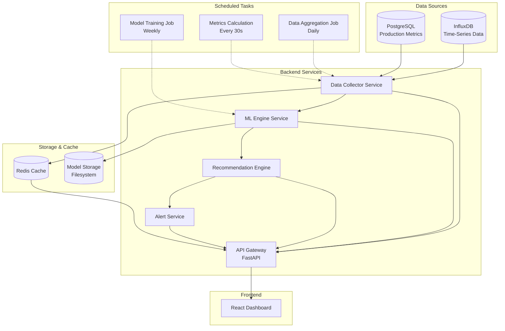

# Design Document: AI-Based Performance Prediction and Optimization System

## Overview

The AI-Based Performance Prediction and Optimization System is a comprehensive analytics platform that leverages machine learning to monitor, predict, and optimize the performance of aging manufacturing machines in Indian MSME units. The system integrates with existing data infrastructure (InfluxDB for time-series sensor data, PostgreSQL for production metrics) to provide real-time monitoring, predictive analytics, and actionable recommendations.

### Key Design Principles

1. **Modularity**: Clear separation between data collection, ML processing, recommendation generation, and presentation layers
2. **Scalability**: Architecture supports single-machine deployment with future expansion to multi-machine monitoring
3. **Reliability**: Robust error handling, data validation, and graceful degradation when data quality issues occur
4. **Explainability**: All predictions and recommendations include confidence scores and feature importance explanations
5. **Real-time Performance**: Sub-5-second data retrieval and 30-second dashboard refresh cycles

### Technology Stack

- **Backend**: Python 3.9+ with FastAPI for REST API
- **ML Framework**: scikit-learn for model training and inference
- **Time-Series Database**: InfluxDB (existing infrastructure)
- **Relational Database**: PostgreSQL (existing infrastructure)
- **Frontend**: React with TypeScript for dashboard UI
- **Visualization**: Recharts for charts and graphs
- **Caching**: Redis for caching predictions and computed metrics
- **Task Scheduling**: Celery with Redis broker for periodic model training and data aggregation

## Architecture

### System Architecture Diagram



### Component Architecture

#### 1. Data Collector Service

**Responsibilities**:
- Connect to InfluxDB and PostgreSQL with configurable credentials
- Retrieve sensor data (output rate, temperature, vibration, power, load) within 5 seconds
- Retrieve production metrics (actual output, downtime, maintenance logs)
- Validate data quality and flag anomalies
- Cache frequently accessed data in Redis

**Key Classes**:
- `InfluxDBConnector`: Manages InfluxDB connections with retry logic
- `PostgreSQLConnector`: Manages PostgreSQL connections with retry logic
- `DataValidator`: Validates sensor readings against configured ranges
- `DataAggregator`: Aggregates raw sensor data into meaningful metrics

#### 2. ML Engine Service

**Responsibilities**:
- Train prediction models using historical data
- Generate predictions for next-shift production output
- Calculate feature importance for explainability
- Evaluate model performance and trigger retraining when needed
- Store and version trained models

**Key Classes**:
- `ModelTrainer`: Trains Linear Regression, Random Forest, and Gradient Boosting models
- `ModelEvaluator`: Calculates MAPE, R-squared, and selects best model
- `PredictionService`: Generates predictions with confidence intervals
- `FeatureImportanceCalculator`: Computes and ranks feature importance

#### 3. Recommendation Engine

**Responsibilities**:
- Analyze performance gaps between actual and achievable output
- Generate parameter optimization recommendations
- Suggest maintenance actions based on degradation patterns
- Provide energy efficiency improvement suggestions
- Track recommendation effectiveness

**Key Classes**:
- `PerformanceAnalyzer`: Identifies performance gaps and root causes
- `ParameterOptimizer`: Suggests optimal operating parameter ranges
- `MaintenanceAdvisor`: Recommends maintenance actions based on health scores
- `EnergyOptimizer`: Identifies energy waste and optimization opportunities
- `RecommendationTracker`: Tracks implemented recommendations and actual impact

#### 4. Alert Service

**Responsibilities**:
- Monitor metrics against configured thresholds
- Generate alerts for performance, health, and planning issues
- Log alerts to PostgreSQL for historical tracking
- Support configurable alert thresholds

**Key Classes**:
- `AlertMonitor`: Continuously monitors metrics and triggers alerts
- `AlertManager`: Manages alert lifecycle and persistence
- `ThresholdConfiguration`: Stores and validates alert thresholds

#### 5. API Gateway (FastAPI)

**Responsibilities**:
- Expose REST API endpoints for dashboard
- Handle authentication and authorization
- Aggregate data from multiple services
- Serve cached data when available

**Key Endpoints**:
- `GET /api/v1/metrics/current`: Current efficiency, health, and output metrics
- `GET /api/v1/predictions/next-shift`: Predicted output for next 8-hour shift
- `GET /api/v1/degradation/trends`: Historical degradation analysis
- `GET /api/v1/recommendations`: Top recommendations with expected impact
- `GET /api/v1/alerts`: Active and historical alerts
- `GET /api/v1/reports/generate`: Generate historical reports
- `POST /api/v1/config`: Update system configuration

#### 6. React Dashboard

**Responsibilities**:
- Display real-time metrics with 30-second refresh
- Visualize trends, predictions, and comparisons
- Present recommendations with actionable details
- Support report generation and export
- Provide configuration interface

**Key Components**:
- `SummaryPanel`: Shows efficiency score, health score, and alerts
- `ComparisonChart`: Displays rated vs actual vs achievable output
- `TrendGraph`: Shows historical performance and projections
- `RecommendationsPanel`: Lists top 5 recommendations
- `SensorReadings`: Real-time sensor data with status indicators
- `ReportGenerator`: Exports PDF/CSV reports


## Components and Interfaces

### Data Collector Service

#### InfluxDBConnector

```python
class InfluxDBConnector:
    """Manages connections to InfluxDB with retry logic and error handling."""
    
    def __init__(self, host: str, port: int, database: str, username: str, password: str):
        """Initialize connection parameters."""
        
    def connect(self) -> bool:
        """Establish connection with exponential backoff retry (max 3 attempts)."""
        
    def query_sensor_data(
        self, 
        measurement: str, 
        start_time: datetime, 
        end_time: datetime,
        fields: List[str]
    ) -> pd.DataFrame:
        """Query time-series sensor data within time range.
        
        Returns DataFrame with columns: timestamp, field_name, value
        Raises: ConnectionError if connection fails after retries
        """
        
    def validate_connection(self) -> bool:
        """Test connection health."""
```

#### PostgreSQLConnector

```python
class PostgreSQLConnector:
    """Manages connections to PostgreSQL with retry logic."""
    
    def __init__(self, host: str, port: int, database: str, username: str, password: str):
        """Initialize connection parameters."""
        
    def connect(self) -> bool:
        """Establish connection with exponential backoff retry (max 3 attempts)."""
        
    def query_production_metrics(
        self, 
        start_time: datetime, 
        end_time: datetime
    ) -> pd.DataFrame:
        """Query production metrics (actual output, downtime, maintenance logs).
        
        Returns DataFrame with columns: timestamp, actual_output, downtime_minutes, 
                                       maintenance_type, breakdown_duration
        """
        
    def store_alert(self, alert: Alert) -> int:
        """Store alert to database and return alert ID."""
        
    def store_recommendation_impact(self, recommendation_id: int, actual_impact: float):
        """Store actual impact of implemented recommendation."""
```

#### DataValidator

```python
class DataValidator:
    """Validates sensor data quality and flags anomalies."""
    
    def __init__(self, sensor_ranges: Dict[str, Tuple[float, float]]):
        """Initialize with configurable min/max ranges per sensor."""
        
    def validate_sensor_reading(
        self, 
        sensor_name: str, 
        value: float
    ) -> ValidationResult:
        """Validate single sensor reading against configured range.
        
        Returns ValidationResult with is_valid flag and reason if invalid
        """
        
    def detect_anomalies(
        self, 
        sensor_data: pd.DataFrame, 
        sensor_name: str
    ) -> List[AnomalyRecord]:
        """Detect anomalies using 3-sigma rule.
        
        Returns list of anomalous readings with timestamps
        """
        
    def calculate_data_quality_score(
        self, 
        sensor_data: pd.DataFrame, 
        time_window: timedelta
    ) -> float:
        """Calculate percentage of valid data points in time window.
        
        Returns score between 0.0 and 1.0
        """
```

#### DataAggregator

```python
class DataAggregator:
    """Aggregates raw sensor data into meaningful metrics."""
    
    def calculate_efficiency_score(
        self, 
        actual_output: float, 
        rated_capacity: float
    ) -> float:
        """Calculate efficiency as (actual_output / rated_capacity) * 100."""
        
    def calculate_energy_efficiency(
        self, 
        power_consumption: float, 
        output: float
    ) -> float:
        """Calculate power consumption per unit output (kWh/meter)."""
        
    def aggregate_sensor_data(
        self, 
        sensor_data: pd.DataFrame, 
        aggregation_period: str
    ) -> pd.DataFrame:
        """Aggregate sensor data by period (e.g., '30s', '1h', '1d').
        
        Returns DataFrame with mean, min, max, std for each sensor
        """
```

### ML Engine Service

#### ModelTrainer

```python
class ModelTrainer:
    """Trains and manages ML models for production prediction."""
    
    def __init__(self, algorithms: List[str] = ['linear', 'random_forest', 'gradient_boosting']):
        """Initialize with list of algorithms to train."""
        
    def prepare_training_data(
        self, 
        historical_data: pd.DataFrame, 
        lookback_days: int = 90
    ) -> Tuple[np.ndarray, np.ndarray]:
        """Prepare features (X) and target (y) from historical data.
        
        Features: temperature, vibration, power, load, speed, downtime_hours
        Target: actual_output
        
        Returns: (X_train, y_train) with 80/20 split
        """
        
    def train_model(
        self, 
        X_train: np.ndarray, 
        y_train: np.ndarray, 
        algorithm: str
    ) -> TrainedModel:
        """Train single model with specified algorithm.
        
        Returns TrainedModel object with fitted estimator and metadata
        """
        
    def train_all_models(
        self, 
        historical_data: pd.DataFrame
    ) -> List[TrainedModel]:
        """Train all configured algorithms and return list of trained models."""
```

#### ModelEvaluator

```python
class ModelEvaluator:
    """Evaluates model performance and selects best model."""
    
    def calculate_mape(
        self, 
        y_true: np.ndarray, 
        y_pred: np.ndarray
    ) -> float:
        """Calculate Mean Absolute Percentage Error."""
        
    def calculate_r_squared(
        self, 
        y_true: np.ndarray, 
        y_pred: np.ndarray
    ) -> float:
        """Calculate R-squared score."""
        
    def evaluate_model(
        self, 
        model: TrainedModel, 
        X_val: np.ndarray, 
        y_val: np.ndarray
    ) -> ModelMetrics:
        """Evaluate model on validation set.
        
        Returns ModelMetrics with MAPE, R-squared, and validation predictions
        """
        
    def select_best_model(
        self, 
        models: List[TrainedModel], 
        X_val: np.ndarray, 
        y_val: np.ndarray
    ) -> TrainedModel:
        """Select model with lowest MAPE below 10% threshold.
        
        Returns best model or raises ModelPerformanceError if all exceed threshold
        """
```

#### PredictionService

```python
class PredictionService:
    """Generates predictions with confidence intervals."""
    
    def __init__(self, model: TrainedModel):
        """Initialize with trained model."""
        
    def predict_next_shift(
        self, 
        current_parameters: Dict[str, float], 
        shift_duration_hours: int = 8
    ) -> Prediction:
        """Predict production output for next shift.
        
        Returns Prediction with value, confidence_score, and confidence_interval
        """
        
    def calculate_confidence_interval(
        self, 
        prediction: float, 
        historical_errors: np.ndarray
    ) -> Tuple[float, float]:
        """Calculate 95% confidence interval based on historical prediction errors."""
        
    def should_display_confidence_interval(self, confidence_score: float) -> bool:
        """Return True if confidence below 80% threshold."""
```

#### FeatureImportanceCalculator

```python
class FeatureImportanceCalculator:
    """Calculates and ranks feature importance for explainability."""
    
    def calculate_feature_importance(
        self, 
        model: TrainedModel
    ) -> Dict[str, float]:
        """Extract feature importance from trained model.
        
        Returns dict mapping feature names to importance scores (0-1)
        """
        
    def get_top_features(
        self, 
        feature_importance: Dict[str, float], 
        top_n: int = 3
    ) -> List[Tuple[str, float]]:
        """Return top N features sorted by importance."""
```

### Recommendation Engine

#### PerformanceAnalyzer

```python
class PerformanceAnalyzer:
    """Analyzes performance gaps and identifies root causes."""
    
    def calculate_performance_gap(
        self, 
        actual_output: float, 
        maximum_achievable_output: float
    ) -> float:
        """Calculate gap as percentage: (max - actual) / max * 100."""
        
    def should_generate_recommendations(self, performance_gap: float) -> bool:
        """Return True if gap exceeds 10% threshold."""
        
    def analyze_parameter_correlations(
        self, 
        historical_data: pd.DataFrame
    ) -> Dict[str, float]:
        """Calculate correlation between parameters and efficiency.
        
        Returns dict mapping parameter names to correlation coefficients
        """
```

#### ParameterOptimizer

```python
class ParameterOptimizer:
    """Generates parameter optimization recommendations."""
    
    def find_optimal_parameter_ranges(
        self, 
        historical_data: pd.DataFrame, 
        parameter_name: str
    ) -> Tuple[float, float]:
        """Find parameter range associated with top 10% efficiency periods.
        
        Returns (min_value, max_value) for optimal range
        """
        
    def generate_parameter_recommendation(
        self, 
        parameter_name: str, 
        current_value: float, 
        optimal_range: Tuple[float, float]
    ) -> Recommendation:
        """Generate recommendation if current value outside optimal range.
        
        Returns Recommendation with suggested value, expected impact, and confidence
        """
```

#### MaintenanceAdvisor

```python
class MaintenanceAdvisor:
    """Recommends maintenance actions based on health scores and degradation."""
    
    def calculate_machine_health_score(
        self, 
        degradation_rate: float, 
        downtime_frequency: float, 
        efficiency_variance: float
    ) -> float:
        """Calculate composite health score (0-100).
        
        Formula: 100 - (degradation_weight * degradation_rate + 
                        downtime_weight * downtime_frequency + 
                        variance_weight * efficiency_variance)
        """
        
    def should_recommend_maintenance(
        self, 
        health_score: float, 
        maximum_achievable_output: float, 
        rated_capacity: float
    ) -> bool:
        """Return True if health < 60 or achievable < 85% of rated."""
        
    def generate_maintenance_recommendation(
        self, 
        health_score: float, 
        degradation_patterns: Dict[str, float]
    ) -> Recommendation:
        """Generate maintenance recommendation based on health and patterns."""
```

#### EnergyOptimizer

```python
class EnergyOptimizer:
    """Identifies energy optimization opportunities."""
    
    def calculate_energy_efficiency_baseline(
        self, 
        historical_data: pd.DataFrame, 
        days: int = 30
    ) -> float:
        """Calculate average kWh/meter over specified days."""
        
    def identify_inefficient_periods(
        self, 
        sensor_data: pd.DataFrame, 
        baseline: float
    ) -> List[InefficiencyRecord]:
        """Find periods where power consumption exceeds baseline without output increase.
        
        Returns list of records with timestamp, power, output, and efficiency
        """
        
    def estimate_cost_savings(
        self, 
        potential_reduction_kwh: float, 
        electricity_rate: float
    ) -> float:
        """Calculate estimated cost savings from energy optimization."""
```

#### RecommendationTracker

```python
class RecommendationTracker:
    """Tracks recommendation implementation and actual impact."""
    
    def record_recommendation(self, recommendation: Recommendation) -> int:
        """Store recommendation and return recommendation ID."""
        
    def mark_implemented(
        self, 
        recommendation_id: int, 
        implementation_timestamp: datetime
    ):
        """Mark recommendation as implemented."""
        
    def record_actual_impact(
        self, 
        recommendation_id: int, 
        actual_impact: float
    ):
        """Record measured impact after implementation."""
        
    def update_confidence_scores(self):
        """Update recommendation confidence based on historical accuracy."""
```

### Alert Service

#### AlertMonitor

```python
class AlertMonitor:
    """Monitors metrics and triggers alerts based on thresholds."""
    
    def __init__(self, thresholds: ThresholdConfiguration):
        """Initialize with configured alert thresholds."""
        
    def check_efficiency_alert(self, efficiency_score: float) -> Optional[Alert]:
        """Generate alert if efficiency below threshold (default 70%)."""
        
    def check_health_alert(self, health_score: float) -> Optional[Alert]:
        """Generate critical alert if health below 60."""
        
    def check_planning_alert(
        self, 
        predicted_output: float, 
        production_target: float
    ) -> Optional[Alert]:
        """Generate alert if prediction below target by more than 20%."""
        
    def monitor_all_metrics(
        self, 
        current_metrics: Dict[str, float]
    ) -> List[Alert]:
        """Check all metrics and return list of triggered alerts."""
```

#### AlertManager

```python
class AlertManager:
    """Manages alert lifecycle and persistence."""
    
    def create_alert(
        self, 
        severity: str, 
        message: str, 
        affected_machine: str
    ) -> Alert:
        """Create alert with timestamp and unique ID."""
        
    def persist_alert(self, alert: Alert) -> int:
        """Store alert to PostgreSQL and return alert ID."""
        
    def get_active_alerts(self) -> List[Alert]:
        """Retrieve all unacknowledged alerts."""
        
    def acknowledge_alert(self, alert_id: int):
        """Mark alert as acknowledged."""
```


## Data Models

### Core Data Models

#### MachineConfiguration

```python
@dataclass
class MachineConfiguration:
    """Configuration for a single machine."""
    machine_id: str
    machine_name: str
    rated_capacity: float  # Maximum output when new (meters/hour)
    rated_capacity_unit: str  # e.g., "meters/hour"
    sensor_mappings: Dict[str, str]  # Maps logical sensor names to InfluxDB measurements
    alert_thresholds: Dict[str, float]  # Custom alert thresholds
    created_at: datetime
    updated_at: datetime
```

#### SensorReading

```python
@dataclass
class SensorReading:
    """Single sensor measurement from InfluxDB."""
    timestamp: datetime
    sensor_name: str
    value: float
    unit: str
    is_valid: bool
    validation_message: Optional[str] = None
```

#### ProductionMetrics

```python
@dataclass
class ProductionMetrics:
    """Aggregated production metrics for a time period."""
    timestamp: datetime
    actual_output: float
    output_unit: str
    operating_time_hours: float
    downtime_minutes: float
    power_consumption_kwh: float
    efficiency_score: float  # (actual_output / rated_capacity) * 100
    energy_efficiency: float  # kWh per unit output
```

#### PerformanceSnapshot

```python
@dataclass
class PerformanceSnapshot:
    """Current performance state of a machine."""
    machine_id: str
    timestamp: datetime
    efficiency_score: float
    actual_output: float
    rated_capacity: float
    maximum_achievable_output: float
    machine_health_score: float
    sensor_readings: Dict[str, float]  # Current sensor values
    data_quality_score: float
```

### ML Model Data Models

#### TrainedModel

```python
@dataclass
class TrainedModel:
    """Metadata and artifacts for a trained ML model."""
    model_id: str
    algorithm: str  # 'linear', 'random_forest', 'gradient_boosting'
    trained_at: datetime
    training_data_period: Tuple[datetime, datetime]
    feature_names: List[str]
    feature_importance: Dict[str, float]
    validation_mape: float
    validation_r_squared: float
    model_artifact_path: str  # Path to serialized model file
    is_active: bool
```

#### Prediction

```python
@dataclass
class Prediction:
    """Production prediction with confidence metrics."""
    prediction_id: str
    machine_id: str
    predicted_at: datetime
    prediction_horizon: str  # e.g., "next_8_hour_shift"
    predicted_output: float
    confidence_score: float  # 0.0 to 1.0
    confidence_interval: Optional[Tuple[float, float]]  # (lower, upper) if confidence < 0.8
    top_influencing_factors: List[Tuple[str, float]]  # Top 3 features with importance
    model_id: str
```

#### ModelMetrics

```python
@dataclass
class ModelMetrics:
    """Performance metrics for model evaluation."""
    model_id: str
    mape: float  # Mean Absolute Percentage Error
    r_squared: float
    mae: float  # Mean Absolute Error
    rmse: float  # Root Mean Squared Error
    validation_predictions: np.ndarray
    validation_actuals: np.ndarray
```

### Recommendation Data Models

#### Recommendation

```python
@dataclass
class Recommendation:
    """Actionable recommendation for performance improvement."""
    recommendation_id: str
    machine_id: str
    generated_at: datetime
    category: str  # 'parameter_optimization', 'maintenance', 'energy_efficiency'
    title: str
    description: str
    suggested_action: str
    expected_impact_percentage: float
    confidence_score: float
    implementation_difficulty: str  # 'low', 'medium', 'high'
    is_implemented: bool = False
    implemented_at: Optional[datetime] = None
    actual_impact_percentage: Optional[float] = None
```

#### DegradationAnalysis

```python
@dataclass
class DegradationAnalysis:
    """Long-term performance degradation analysis."""
    machine_id: str
    analysis_period: Tuple[datetime, datetime]
    baseline_efficiency: float  # Average efficiency 12 months ago
    current_efficiency: float
    degradation_rate_per_month: float  # Percentage decline per month
    projected_efficiency_6_months: float
    trend_line_coefficients: Tuple[float, float]  # (slope, intercept)
    monthly_averages: List[Tuple[datetime, float]]  # (month, avg_efficiency)
```

### Alert Data Models

#### Alert

```python
@dataclass
class Alert:
    """System alert for performance or health issues."""
    alert_id: str
    machine_id: str
    severity: str  # 'info', 'warning', 'critical'
    alert_type: str  # 'performance', 'health', 'planning', 'data_quality'
    message: str
    triggered_at: datetime
    acknowledged: bool = False
    acknowledged_at: Optional[datetime] = None
    acknowledged_by: Optional[str] = None
    related_metric: Optional[str] = None
    metric_value: Optional[float] = None
```

#### ThresholdConfiguration

```python
@dataclass
class ThresholdConfiguration:
    """Configurable alert thresholds."""
    efficiency_threshold: float = 70.0  # Percentage
    health_threshold: float = 60.0  # Score 0-100
    planning_deviation_threshold: float = 20.0  # Percentage
    data_quality_threshold: float = 90.0  # Percentage
    degradation_rate_threshold: float = 2.0  # Percentage per month
    energy_efficiency_degradation_threshold: float = 10.0  # Percentage
```

### Validation and Quality Models

#### ValidationResult

```python
@dataclass
class ValidationResult:
    """Result of data validation check."""
    is_valid: bool
    sensor_name: str
    value: float
    expected_range: Tuple[float, float]
    reason: Optional[str] = None
```

#### AnomalyRecord

```python
@dataclass
class AnomalyRecord:
    """Record of detected anomalous sensor reading."""
    timestamp: datetime
    sensor_name: str
    value: float
    expected_mean: float
    expected_std: float
    sigma_deviation: float  # How many standard deviations from mean
```

#### InefficiencyRecord

```python
@dataclass
class InefficiencyRecord:
    """Record of energy inefficiency period."""
    start_time: datetime
    end_time: datetime
    average_power_consumption: float
    average_output: float
    energy_efficiency: float  # kWh/meter
    baseline_efficiency: float
    excess_consumption_kwh: float
```

### Report Data Models

#### PerformanceReport

```python
@dataclass
class PerformanceReport:
    """Historical performance report."""
    report_id: str
    machine_id: str
    report_period: Tuple[datetime, datetime]
    generated_at: datetime
    summary_statistics: Dict[str, float]  # avg_efficiency, total_downtime, etc.
    comparison_metrics: Dict[str, float]  # Changes vs previous period
    degradation_analysis: DegradationAnalysis
    top_recommendations: List[Recommendation]
    charts: Dict[str, str]  # Chart names to base64 encoded images
    export_format: str  # 'pdf' or 'csv'
```

### Database Schemas

#### PostgreSQL Tables

**machines**
```sql
CREATE TABLE machines (
    machine_id VARCHAR(50) PRIMARY KEY,
    machine_name VARCHAR(255) NOT NULL,
    rated_capacity FLOAT NOT NULL,
    rated_capacity_unit VARCHAR(50) NOT NULL,
    sensor_mappings JSONB NOT NULL,
    alert_thresholds JSONB NOT NULL,
    created_at TIMESTAMP NOT NULL DEFAULT NOW(),
    updated_at TIMESTAMP NOT NULL DEFAULT NOW()
);
```

**trained_models**
```sql
CREATE TABLE trained_models (
    model_id VARCHAR(50) PRIMARY KEY,
    machine_id VARCHAR(50) REFERENCES machines(machine_id),
    algorithm VARCHAR(50) NOT NULL,
    trained_at TIMESTAMP NOT NULL,
    training_start_date DATE NOT NULL,
    training_end_date DATE NOT NULL,
    feature_names JSONB NOT NULL,
    feature_importance JSONB NOT NULL,
    validation_mape FLOAT NOT NULL,
    validation_r_squared FLOAT NOT NULL,
    model_artifact_path VARCHAR(500) NOT NULL,
    is_active BOOLEAN NOT NULL DEFAULT TRUE
);
```

**predictions**
```sql
CREATE TABLE predictions (
    prediction_id VARCHAR(50) PRIMARY KEY,
    machine_id VARCHAR(50) REFERENCES machines(machine_id),
    model_id VARCHAR(50) REFERENCES trained_models(model_id),
    predicted_at TIMESTAMP NOT NULL,
    prediction_horizon VARCHAR(50) NOT NULL,
    predicted_output FLOAT NOT NULL,
    confidence_score FLOAT NOT NULL,
    confidence_interval_lower FLOAT,
    confidence_interval_upper FLOAT,
    top_influencing_factors JSONB NOT NULL
);
```

**recommendations**
```sql
CREATE TABLE recommendations (
    recommendation_id VARCHAR(50) PRIMARY KEY,
    machine_id VARCHAR(50) REFERENCES machines(machine_id),
    generated_at TIMESTAMP NOT NULL,
    category VARCHAR(50) NOT NULL,
    title VARCHAR(255) NOT NULL,
    description TEXT NOT NULL,
    suggested_action TEXT NOT NULL,
    expected_impact_percentage FLOAT NOT NULL,
    confidence_score FLOAT NOT NULL,
    implementation_difficulty VARCHAR(20) NOT NULL,
    is_implemented BOOLEAN NOT NULL DEFAULT FALSE,
    implemented_at TIMESTAMP,
    actual_impact_percentage FLOAT
);
```

**alerts**
```sql
CREATE TABLE alerts (
    alert_id VARCHAR(50) PRIMARY KEY,
    machine_id VARCHAR(50) REFERENCES machines(machine_id),
    severity VARCHAR(20) NOT NULL,
    alert_type VARCHAR(50) NOT NULL,
    message TEXT NOT NULL,
    triggered_at TIMESTAMP NOT NULL,
    acknowledged BOOLEAN NOT NULL DEFAULT FALSE,
    acknowledged_at TIMESTAMP,
    acknowledged_by VARCHAR(100),
    related_metric VARCHAR(100),
    metric_value FLOAT
);
```

**prediction_actuals**
```sql
CREATE TABLE prediction_actuals (
    prediction_id VARCHAR(50) REFERENCES predictions(prediction_id),
    actual_output FLOAT NOT NULL,
    recorded_at TIMESTAMP NOT NULL,
    deviation_percentage FLOAT NOT NULL,
    PRIMARY KEY (prediction_id)
);
```

#### InfluxDB Measurements

**sensor_readings**
- Measurement: `machine_sensors`
- Tags: `machine_id`, `sensor_name`
- Fields: `value`, `unit`
- Timestamp: nanosecond precision

**aggregated_metrics**
- Measurement: `performance_metrics`
- Tags: `machine_id`
- Fields: `efficiency_score`, `actual_output`, `power_consumption`, `energy_efficiency`
- Timestamp: 30-second intervals


## API Design

### REST API Endpoints

#### Metrics Endpoints

**GET /api/v1/metrics/current**
```
Description: Get current performance metrics for a machine
Query Parameters:
  - machine_id: string (required)
Response: PerformanceSnapshot
Status Codes: 200 OK, 404 Not Found, 500 Internal Server Error
```

**GET /api/v1/metrics/historical**
```
Description: Get historical metrics for a time range
Query Parameters:
  - machine_id: string (required)
  - start_time: ISO 8601 datetime (required)
  - end_time: ISO 8601 datetime (required)
  - aggregation: string (optional, default: "30s", values: "30s", "1h", "1d")
Response: List[ProductionMetrics]
Status Codes: 200 OK, 400 Bad Request, 404 Not Found
```

#### Prediction Endpoints

**GET /api/v1/predictions/next-shift**
```
Description: Get production prediction for next shift
Query Parameters:
  - machine_id: string (required)
  - shift_duration_hours: int (optional, default: 8)
Response: Prediction
Status Codes: 200 OK, 404 Not Found, 503 Service Unavailable (if model not trained)
```

**GET /api/v1/predictions/history**
```
Description: Get historical predictions with actual outcomes
Query Parameters:
  - machine_id: string (required)
  - start_time: ISO 8601 datetime (required)
  - end_time: ISO 8601 datetime (required)
Response: List[Prediction with actual_output]
Status Codes: 200 OK, 400 Bad Request
```

#### Degradation Endpoints

**GET /api/v1/degradation/trends**
```
Description: Get degradation analysis and trends
Query Parameters:
  - machine_id: string (required)
  - analysis_months: int (optional, default: 12)
Response: DegradationAnalysis
Status Codes: 200 OK, 404 Not Found
```

**GET /api/v1/degradation/health-score**
```
Description: Get current machine health score
Query Parameters:
  - machine_id: string (required)
Response: { machine_id: string, health_score: float, calculated_at: datetime }
Status Codes: 200 OK, 404 Not Found
```

#### Recommendation Endpoints

**GET /api/v1/recommendations**
```
Description: Get active recommendations for a machine
Query Parameters:
  - machine_id: string (required)
  - category: string (optional, values: "parameter_optimization", "maintenance", "energy_efficiency")
  - top_n: int (optional, default: 5)
Response: List[Recommendation]
Status Codes: 200 OK, 404 Not Found
```

**POST /api/v1/recommendations/{recommendation_id}/implement**
```
Description: Mark recommendation as implemented
Path Parameters:
  - recommendation_id: string (required)
Request Body: { implemented_at: datetime }
Response: Recommendation
Status Codes: 200 OK, 404 Not Found
```

**POST /api/v1/recommendations/{recommendation_id}/impact**
```
Description: Record actual impact of implemented recommendation
Path Parameters:
  - recommendation_id: string (required)
Request Body: { actual_impact_percentage: float }
Response: Recommendation
Status Codes: 200 OK, 404 Not Found, 400 Bad Request
```

#### Alert Endpoints

**GET /api/v1/alerts**
```
Description: Get alerts for a machine
Query Parameters:
  - machine_id: string (required)
  - severity: string (optional, values: "info", "warning", "critical")
  - acknowledged: boolean (optional)
  - start_time: ISO 8601 datetime (optional)
  - end_time: ISO 8601 datetime (optional)
Response: List[Alert]
Status Codes: 200 OK, 404 Not Found
```

**POST /api/v1/alerts/{alert_id}/acknowledge**
```
Description: Acknowledge an alert
Path Parameters:
  - alert_id: string (required)
Request Body: { acknowledged_by: string }
Response: Alert
Status Codes: 200 OK, 404 Not Found
```

#### Report Endpoints

**POST /api/v1/reports/generate**
```
Description: Generate performance report
Request Body: {
  machine_id: string,
  start_time: datetime,
  end_time: datetime,
  report_type: string ("daily" | "weekly" | "monthly" | "quarterly"),
  export_format: string ("pdf" | "csv")
}
Response: PerformanceReport
Status Codes: 200 OK, 400 Bad Request, 404 Not Found
```

**GET /api/v1/reports/{report_id}/download**
```
Description: Download generated report
Path Parameters:
  - report_id: string (required)
Response: Binary file (PDF or CSV)
Status Codes: 200 OK, 404 Not Found
```

#### Configuration Endpoints

**GET /api/v1/config/machine/{machine_id}**
```
Description: Get machine configuration
Path Parameters:
  - machine_id: string (required)
Response: MachineConfiguration
Status Codes: 200 OK, 404 Not Found
```

**PUT /api/v1/config/machine/{machine_id}**
```
Description: Update machine configuration
Path Parameters:
  - machine_id: string (required)
Request Body: MachineConfiguration (partial updates allowed)
Response: MachineConfiguration
Status Codes: 200 OK, 400 Bad Request, 404 Not Found
```

**GET /api/v1/config/thresholds**
```
Description: Get alert threshold configuration
Response: ThresholdConfiguration
Status Codes: 200 OK
```

**PUT /api/v1/config/thresholds**
```
Description: Update alert thresholds
Request Body: ThresholdConfiguration (partial updates allowed)
Response: ThresholdConfiguration
Status Codes: 200 OK, 400 Bad Request
```

#### Model Management Endpoints

**POST /api/v1/models/train**
```
Description: Trigger model training
Request Body: {
  machine_id: string,
  algorithm: string ("linear" | "random_forest" | "gradient_boosting"),
  lookback_days: int (optional, default: 90)
}
Response: { job_id: string, status: string }
Status Codes: 202 Accepted, 400 Bad Request
```

**GET /api/v1/models/status/{job_id}**
```
Description: Get model training job status
Path Parameters:
  - job_id: string (required)
Response: { job_id: string, status: string, progress: float, model_id: string }
Status Codes: 200 OK, 404 Not Found
```

**GET /api/v1/models/active/{machine_id}**
```
Description: Get active model for a machine
Path Parameters:
  - machine_id: string (required)
Response: TrainedModel
Status Codes: 200 OK, 404 Not Found
```

### WebSocket API

**WS /api/v1/ws/metrics/{machine_id}**
```
Description: Real-time metrics stream with 30-second updates
Message Format: PerformanceSnapshot (JSON)
```

**WS /api/v1/ws/alerts/{machine_id}**
```
Description: Real-time alert notifications
Message Format: Alert (JSON)
```


## Dashboard UI Specifications

### Layout Structure

The dashboard follows a responsive grid layout with the following sections:

```
+----------------------------------------------------------+
|  Header: Machine Selector | Time Range | Export | Config |
+----------------------------------------------------------+
|  Summary Panel (Full Width)                              |
|  - Efficiency Score | Health Score | Active Alerts       |
+----------------------------------------------------------+
|  Performance Comparison (50%)  |  Sensor Readings (50%)  |
|  - Rated vs Actual vs Max      |  - Temperature          |
|  - Bar Chart                   |  - Vibration            |
|                                |  - Power                |
+----------------------------------------------------------+
|  Performance Trends (Full Width)                         |
|  - Historical Efficiency Line Chart                      |
|  - Projected Performance (dashed line)                   |
+----------------------------------------------------------+
|  Recommendations (60%)         |  Recent Alerts (40%)    |
|  - Top 5 Ranked by Impact      |  - Last 10 Alerts       |
|  - Action Buttons              |  - Acknowledge Buttons  |
+----------------------------------------------------------+
|  Energy Efficiency (50%)       |  Data Quality (50%)     |
|  - kWh/meter Trend             |  - Quality Score        |
|  - Cost Savings                |  - Missing Data %       |
+----------------------------------------------------------+
```

### Component Specifications

#### 1. Summary Panel Component

**Purpose**: Display key metrics at a glance

**Data Requirements**:
- Current efficiency_score (float)
- Current machine_health_score (float)
- Active alerts count by severity

**Visual Design**:
- Three large metric cards side-by-side
- Color coding: Green (>80%), Yellow (60-80%), Red (<60%)
- Trend indicators (up/down arrows) showing 24-hour change
- Last updated timestamp

**Update Frequency**: 30 seconds via WebSocket

#### 2. Performance Comparison Chart Component

**Purpose**: Compare rated capacity, actual output, and maximum achievable output

**Data Requirements**:
- rated_capacity (float)
- actual_output (float)
- maximum_achievable_output (float)
- All values in same unit (meters/hour)

**Visual Design**:
- Horizontal bar chart with three bars
- Color coding: Rated (blue), Actual (green), Max Achievable (orange)
- Percentage labels on bars
- Gap indicator showing difference between actual and max achievable

**Update Frequency**: 30 seconds

#### 3. Sensor Readings Component

**Purpose**: Display real-time sensor values with status indicators

**Data Requirements**:
- temperature (float, °C)
- vibration (float, mm/s)
- power_consumption (float, kW)
- load (float, %)
- For each: current value, normal range, status

**Visual Design**:
- List of sensor cards
- Status indicator: Green (normal), Yellow (warning), Red (critical)
- Gauge visualization for each sensor
- Normal range displayed as background zone

**Update Frequency**: 30 seconds via WebSocket

#### 4. Performance Trends Graph Component

**Purpose**: Show historical performance and future projections

**Data Requirements**:
- Historical efficiency_score (monthly averages for 24 months)
- Regression line coefficients
- Projected values for next 6 months

**Visual Design**:
- Line chart with time on X-axis, efficiency on Y-axis
- Historical data: solid line
- Projected data: dashed line
- Shaded confidence interval for projections
- Markers for significant events (maintenance, breakdowns)

**Interactions**:
- Hover to see exact values
- Click to zoom into time period
- Toggle between daily/weekly/monthly aggregation

**Update Frequency**: Daily (static data, no real-time updates needed)

#### 5. Recommendations Panel Component

**Purpose**: Display actionable recommendations ranked by impact

**Data Requirements**:
- List of top 5 recommendations
- For each: title, description, expected_impact, confidence, difficulty, category

**Visual Design**:
- Ordered list with rank numbers
- Category badges (color-coded)
- Impact percentage prominently displayed
- Confidence score as progress bar
- Difficulty indicator (Low/Medium/High with icons)
- "Implement" button for each recommendation

**Interactions**:
- Click "Implement" to mark as implemented
- Expand/collapse for full description
- Filter by category

**Update Frequency**: When new recommendations generated (typically hourly)

#### 6. Recent Alerts Component

**Purpose**: Show recent alerts requiring attention

**Data Requirements**:
- Last 10 alerts
- For each: severity, message, timestamp, acknowledged status

**Visual Design**:
- List with severity icons (info/warning/critical)
- Color-coded borders
- Timestamp in relative format ("2 hours ago")
- "Acknowledge" button for unacknowledged alerts
- Auto-scroll for new alerts

**Update Frequency**: Real-time via WebSocket

#### 7. Energy Efficiency Component

**Purpose**: Display energy consumption trends and optimization opportunities

**Data Requirements**:
- Daily energy_efficiency (kWh/meter) for past 30 days
- Baseline efficiency
- Estimated cost savings from recommendations
- Electricity rate

**Visual Design**:
- Line chart showing kWh/meter over time
- Horizontal line for baseline
- Highlighted periods of inefficiency
- Cost savings callout box

**Update Frequency**: Daily

#### 8. Data Quality Component

**Purpose**: Show data quality metrics and issues

**Data Requirements**:
- data_quality_score (percentage)
- Missing data percentage
- Anomaly count
- Last validation timestamp

**Visual Design**:
- Circular progress indicator for quality score
- Color coding: Green (>90%), Yellow (80-90%), Red (<80%)
- List of recent data quality issues
- "View Details" link to quality report

**Update Frequency**: Every 5 minutes

### User Interactions

#### Time Range Selection

**Options**:
- Last 1 hour
- Last 8 hours (shift)
- Last 24 hours
- Last 7 days
- Last 30 days
- Custom range (date picker)

**Behavior**:
- Updates all time-dependent visualizations
- Maintains selection in session storage
- Shows loading indicators during data fetch

#### Machine Selection (Multi-Machine Support)

**Options**:
- Dropdown list of configured machines
- "All Machines" option for plant-level view

**Behavior**:
- Switches all dashboard data to selected machine
- Maintains selection in URL parameter
- Shows comparison view when "All Machines" selected

#### Export Functionality

**Options**:
- Export current view as PDF
- Export data as CSV
- Generate full report (opens report configuration modal)

**Behavior**:
- PDF includes all visible charts and metrics
- CSV exports raw data for current time range
- Report generation shows progress indicator

#### Configuration Access

**Options**:
- Machine settings
- Alert thresholds
- Model parameters
- Database connections (admin only)

**Behavior**:
- Opens modal with configuration form
- Validates inputs before saving
- Shows success/error notifications
- Applies changes without page reload

### Responsive Design

**Desktop (>1200px)**:
- Full layout as shown above
- Side-by-side panels

**Tablet (768px - 1200px)**:
- Stack panels vertically
- Reduce chart heights
- Collapse sensor readings to compact view

**Mobile (<768px)**:
- Single column layout
- Swipeable cards for metrics
- Simplified charts
- Bottom navigation for sections

### Accessibility

- WCAG 2.1 AA compliance target
- Keyboard navigation support
- Screen reader labels for all interactive elements
- High contrast mode support
- Focus indicators on all interactive elements
- Alternative text for charts (data tables available)

### Performance Optimization

- Lazy loading for charts (render on scroll)
- Virtual scrolling for long lists (alerts, recommendations)
- Debounced API calls for time range changes
- Cached data with 30-second TTL
- WebSocket connection pooling
- Progressive image loading for exported PDFs


## Correctness Properties

*A property is a characteristic or behavior that should hold true across all valid executions of a system—essentially, a formal statement about what the system should do. Properties serve as the bridge between human-readable specifications and machine-verifiable correctness guarantees.*

### Property Reflection

After analyzing all acceptance criteria, I identified the following redundancies and consolidations:

**Redundant Properties**:
- Requirements 1.3 and 8.1 both test efficiency alert generation - consolidated into Property 3
- Multiple properties test that rendered output contains specific fields - consolidated into comprehensive rendering properties

**Combined Properties**:
- Database connection properties (6.1, 6.2) combined into single connection configuration property
- Display field properties (1.5, 2.5, 4.3, 5.4, 8.4, 9.1, 9.2, 9.5) combined into comprehensive rendering properties
- Alert generation properties (1.3, 3.2, 4.4, 8.2, 8.3, 10.4, 12.5) consolidated by alert type

### Core Calculation Properties

**Property 1: Efficiency Score Calculation**

*For any* actual output value and rated capacity value (where rated capacity > 0), calculating the efficiency score should equal (actual_output / rated_capacity) × 100

**Validates: Requirements 1.2**

**Property 2: Energy Efficiency Calculation**

*For any* power consumption value and output value (where output > 0), calculating energy efficiency should equal power_consumption / output in kWh per unit

**Validates: Requirements 10.1**

**Property 3: Machine Health Score Calculation**

*For any* degradation rate, downtime frequency, and efficiency variance values, the calculated machine health score should be between 0 and 100 inclusive

**Validates: Requirements 3.5**

**Property 4: Degradation Rate Calculation**

*For any* historical performance data spanning 12 months, the degradation rate calculation should produce a percentage per month value by comparing current performance against the baseline

**Validates: Requirements 3.1**

**Property 5: Performance Gap Calculation**

*For any* actual output and maximum achievable output (where maximum achievable > 0), the performance gap should equal ((maximum_achievable - actual) / maximum_achievable) × 100

**Validates: Requirements 5.1**

### Data Retrieval and Performance Properties

**Property 6: Sensor Data Retrieval Time**

*For any* valid time range query to InfluxDB, the data retrieval operation should complete within 5 seconds

**Validates: Requirements 1.1**

**Property 7: Dashboard Update Frequency**

*For any* 30-second time window during active monitoring, the dashboard should receive at least one metrics update via WebSocket

**Validates: Requirements 1.4**

**Property 8: Time-Series Data Timestamps**

*For any* query to InfluxDB for sensor measurements, all returned records should include a valid timestamp field

**Validates: Requirements 6.3**

**Property 9: Production Metrics Completeness**

*For any* query to PostgreSQL for production metrics, the returned data should include fields for actual_output, downtime, maintenance_logs, and breakdown_history

**Validates: Requirements 6.4**

### Alert Generation Properties

**Property 10: Efficiency Alert Threshold**

*For any* efficiency score below the configured threshold (default 70%), the system should generate a performance alert with severity "warning"

**Validates: Requirements 1.3, 8.1**

**Property 11: Health Alert Threshold**

*For any* machine health score below 60, the system should generate a critical maintenance alert with severity "critical"

**Validates: Requirements 8.2**

**Property 12: Degradation Alert Threshold**

*For any* degradation rate exceeding 2% per month, the system should generate a maintenance alert

**Validates: Requirements 3.2**

**Property 13: Planning Alert Threshold**

*For any* predicted output that is below the production target by more than 20%, the system should generate a planning alert

**Validates: Requirements 8.3**

**Property 14: Data Quality Alert Threshold**

*For any* data quality score below 90%, the system should generate a data quality alert

**Validates: Requirements 12.5**

**Property 15: Alert Persistence**

*For any* generated alert, the system should persist the alert to PostgreSQL with all required fields (alert_id, severity, message, timestamp, machine_id)

**Validates: Requirements 8.5**

### Prediction and ML Properties

**Property 16: Prediction Output**

*For any* set of valid current machine parameters, the prediction service should return a prediction object containing predicted_output, confidence_score, and model_id

**Validates: Requirements 2.1**

**Property 17: Confidence Interval Display**

*For any* prediction with confidence score below 0.8, the prediction object should include a confidence_interval tuple with lower and upper bounds

**Validates: Requirements 2.3**

**Property 18: Training Data Window**

*For any* model training operation, the training data should span exactly 90 days from the most recent date

**Validates: Requirements 2.4**

**Property 19: Prediction Deviation Logging**

*For any* actual output that deviates from the prediction by more than 15%, the system should log the deviation to the prediction_actuals table

**Validates: Requirements 2.6**

**Property 20: Data Split Ratio**

*For any* training dataset, splitting the data should result in training set size being 80% (±1%) and validation set size being 20% (±1%) of the total

**Validates: Requirements 7.2**

**Property 21: Model Evaluation Metrics**

*For any* trained model evaluation, the system should calculate and return both MAPE and R-squared metrics

**Validates: Requirements 7.3**

**Property 22: Model Selection Criteria**

*For any* set of trained models where at least one has validation MAPE below 10%, the selected model should be the one with the lowest MAPE

**Validates: Requirements 7.4**

**Property 23: Model Retraining Trigger**

*For any* active model with validation MAPE exceeding 15%, the system should trigger automatic retraining

**Validates: Requirements 7.5**

**Property 24: Model Metadata Storage**

*For any* trained model, the stored metadata should include training_date, algorithm, feature_importance, validation_mape, and validation_r_squared

**Validates: Requirements 7.6**

**Property 25: Feature Importance Top 3**

*For any* prediction display, the system should include exactly the top 3 features ranked by importance score

**Validates: Requirements 13.1**

**Property 26: Feature Importance Storage**

*For any* trained model, the system should calculate and store feature importance scores for all input features

**Validates: Requirements 13.2**

### Recommendation Properties

**Property 27: Recommendation Generation Threshold**

*For any* machine state where efficiency score is below maximum achievable output by more than 10%, the recommendation engine should generate at least one optimization suggestion

**Validates: Requirements 5.1**

**Property 28: Recommendation Categories**

*For any* set of generated recommendations for a machine, the recommendations should include at least one from each category: parameter_optimization, maintenance, and energy_efficiency

**Validates: Requirements 5.3**

**Property 29: Recommendation Required Fields**

*For any* generated recommendation, the recommendation object should include expected_impact_percentage, confidence_score, and implementation_difficulty fields

**Validates: Requirements 5.4**

**Property 30: Recommendation Impact Tracking**

*For any* recommendation marked as implemented, the system should store the implementation timestamp and allow recording of actual_impact_percentage

**Validates: Requirements 5.5**

**Property 31: Maintenance Recommendation Trigger**

*For any* machine where maximum_achievable_output is less than 85% of rated_capacity, the system should generate a maintenance evaluation recommendation

**Validates: Requirements 4.4**

**Property 32: Energy Efficiency Recommendation Trigger**

*For any* machine where energy efficiency has degraded by more than 10% from baseline, the recommendation engine should generate parameter adjustment or maintenance recommendations

**Validates: Requirements 10.4**

**Property 33: Top Recommendations Limit**

*For any* request for top recommendations with limit N, the system should return at most N recommendations sorted by expected_impact_percentage in descending order

**Validates: Requirements 9.4**

### Data Validation Properties

**Property 34: Sensor Range Validation**

*For any* sensor reading with a configured min/max range, the validation result should mark the reading as invalid if the value is outside the range

**Validates: Requirements 12.1**

**Property 35: Anomaly Detection**

*For any* sensor data series, readings that deviate by more than 3 standard deviations from the mean should be flagged as anomalous

**Validates: Requirements 12.3**

**Property 36: Data Quality Score Calculation**

*For any* time window of sensor data, the data quality score should equal (count of valid readings / total expected readings) × 100

**Validates: Requirements 12.4**

**Property 37: Missing Data Detection**

*For any* sensor data stream with a gap exceeding 5 minutes, the system should flag a data quality issue and exclude the affected period from analysis

**Validates: Requirements 12.2**

### Database Connection Properties

**Property 38: Connection Retry Logic**

*For any* database connection failure (InfluxDB or PostgreSQL), the system should retry the connection up to 3 times with exponential backoff before raising an error

**Validates: Requirements 6.5**

**Property 39: Data Validation After Retrieval**

*For any* data retrieved from databases, the system should validate completeness and flag any missing or anomalous values

**Validates: Requirements 6.6**

### Trend and Analysis Properties

**Property 40: Historical Trend Data Range**

*For any* performance trend graph request, the system should return monthly average efficiency scores for exactly 24 months of historical data

**Validates: Requirements 3.3**

**Property 41: Performance Projection**

*For any* historical performance data, the system should fit a regression line and generate projected efficiency values for the next 6 months

**Validates: Requirements 3.4**

**Property 42: Maximum Achievable Output Window**

*For any* maximum achievable output calculation, the system should analyze performance data from a rolling 30-day window

**Validates: Requirements 4.5**

**Property 43: Maximum Output Identification**

*For any* 30-day performance window, the maximum achievable output should equal the best performance achieved under similar operating conditions

**Validates: Requirements 4.1**

**Property 44: Energy Efficiency Baseline**

*For any* energy efficiency analysis, the baseline should be calculated as the average kWh/meter over the past 30 days

**Validates: Requirements 10.3**

**Property 45: Inefficient Period Identification**

*For any* time period where power consumption exceeds the baseline without a corresponding output increase, the system should identify and flag the period as inefficient

**Validates: Requirements 10.2**

### Multi-Machine Properties

**Property 46: Machine Configuration Storage**

*For any* set of machine configurations, the system should store each machine with individual rated_capacity and sensor_mappings

**Validates: Requirements 11.1**

**Property 47: Multi-Machine Summary**

*For any* multi-machine view request, the system should return efficiency_score and machine_health_score for all configured machines

**Validates: Requirements 11.2**

**Property 48: Machine Sorting**

*For any* list of machines with sort criteria (efficiency, health_score, or alert_status), the returned list should be correctly ordered by the specified criterion

**Validates: Requirements 11.3**

**Property 49: Best and Worst Performer Identification**

*For any* set of machines with efficiency scores, the system should correctly identify and highlight the machine with the highest score (best) and lowest score (worst)

**Validates: Requirements 11.4**

**Property 50: Plant-Level Aggregation**

*For any* set of machines, the plant-level performance metrics should be correctly aggregated (e.g., total output = sum of all machine outputs, average efficiency = weighted average)

**Validates: Requirements 11.5**

### Report Generation Properties

**Property 51: Report Summary Statistics**

*For any* generated performance report, the report should include average_efficiency_score, total_downtime, degradation_rate, and energy_consumption statistics

**Validates: Requirements 14.2**

**Property 52: Report Comparison Metrics**

*For any* generated report, the system should include comparison metrics showing performance change versus the previous period of the same duration

**Validates: Requirements 14.3**

**Property 53: Report Completeness**

*For any* exported report, the report should include all relevant charts, tables, and recommendations from the current analysis

**Validates: Requirements 14.5**

### Configuration Properties

**Property 54: Configuration Persistence**

*For any* configuration change (database connections, ML parameters, alert thresholds), the system should persist the change and make it available for retrieval

**Validates: Requirements 15.2, 15.3**

**Property 55: Configuration Hot-Reload**

*For any* valid configuration change, the system should apply the change without requiring a system restart

**Validates: Requirements 15.4**

**Property 56: Configuration Audit Logging**

*For any* configuration change, the system should log the change with timestamp and user identification to the audit log

**Validates: Requirements 15.5**

### Rendering and Display Properties

**Property 57: Metric Unit Display**

*For any* rendered metric display, output values should include "meters/hour" unit and efficiency values should include "%" unit

**Validates: Requirements 1.5**

**Property 58: Prediction Display Fields**

*For any* rendered prediction, the display should include predicted_output, confidence_level, and comparison_with_rated_capacity

**Validates: Requirements 2.5**

**Property 59: Maximum Achievable Display**

*For any* performance comparison display, the system should show all three values: rated_capacity, actual_output, and maximum_achievable_output

**Validates: Requirements 4.3**

**Property 60: Alert Display Fields**

*For any* rendered alert, the display should include severity_level, timestamp, and affected_machine

**Validates: Requirements 8.4**

**Property 61: Summary Panel Fields**

*For any* dashboard summary panel, the display should include current efficiency_score, machine_health_score, and active_alerts_count

**Validates: Requirements 9.1**

**Property 62: Comparison Chart Fields**

*For any* comparison chart, the data should include rated_capacity, actual_output, and maximum_achievable_output

**Validates: Requirements 9.2**

**Property 63: Sensor Reading Status Indicators**

*For any* sensor reading display, each sensor should include a status indicator (normal/warning/critical) based on the value relative to expected ranges

**Validates: Requirements 9.5**

**Property 64: Recommendation Explanation**

*For any* generated recommendation, the recommendation should include an explanation field describing the reasoning based on observed correlations

**Validates: Requirements 13.4**

**Property 65: Confidence Score Display**

*For any* prediction or recommendation display, the system should include the confidence_score alongside the main value

**Validates: Requirements 13.5**

### Cost Calculation Properties

**Property 66: Energy Cost Savings Estimation**

*For any* energy optimization recommendation with potential reduction in kWh and configured electricity rate, the estimated cost savings should equal potential_reduction_kwh × electricity_rate

**Validates: Requirements 10.5**


## Error Handling

### Error Categories

#### 1. Database Connection Errors

**Scenarios**:
- InfluxDB or PostgreSQL connection failure
- Network timeout
- Authentication failure
- Database unavailable

**Handling Strategy**:
- Implement exponential backoff retry (3 attempts)
- Log connection errors with full context
- Return cached data if available
- Display user-friendly error message on dashboard
- Trigger alert for persistent connection failures

**Error Response Format**:
```json
{
  "error": "database_connection_failed",
  "message": "Unable to connect to InfluxDB after 3 attempts",
  "details": {
    "host": "influxdb.example.com",
    "last_attempt": "2024-01-15T10:30:45Z",
    "retry_count": 3
  },
  "fallback": "displaying_cached_data"
}
```

#### 2. Data Quality Errors

**Scenarios**:
- Missing sensor data
- Anomalous readings (beyond 3 sigma)
- Data gaps exceeding 5 minutes
- Invalid data format

**Handling Strategy**:
- Flag affected time periods
- Exclude invalid data from calculations
- Apply interpolation for small gaps (< 1 minute)
- Generate data quality alerts
- Display data quality indicators on dashboard

**Error Response Format**:
```json
{
  "error": "data_quality_issue",
  "message": "Sensor data missing for 8 minutes",
  "details": {
    "sensor": "temperature",
    "gap_start": "2024-01-15T10:22:00Z",
    "gap_end": "2024-01-15T10:30:00Z",
    "gap_duration_minutes": 8
  },
  "action": "excluded_from_analysis"
}
```

#### 3. Model Training Errors

**Scenarios**:
- Insufficient training data
- All models exceed MAPE threshold (10%)
- Training job timeout
- Model serialization failure

**Handling Strategy**:
- Validate data sufficiency before training (minimum 30 days)
- Continue using previous model if new training fails
- Log training failures with detailed diagnostics
- Notify administrators of training failures
- Provide fallback to simpler model (linear regression)

**Error Response Format**:
```json
{
  "error": "model_training_failed",
  "message": "All trained models exceed MAPE threshold",
  "details": {
    "models_trained": ["linear", "random_forest", "gradient_boosting"],
    "best_mape": 12.5,
    "threshold": 10.0,
    "training_data_period": "2023-10-15 to 2024-01-15"
  },
  "fallback": "using_previous_model",
  "previous_model_id": "model_20240101_rf"
}
```

#### 4. Prediction Errors

**Scenarios**:
- No trained model available
- Invalid input parameters
- Model inference failure
- Confidence score calculation error

**Handling Strategy**:
- Return error with clear message if no model available
- Validate input parameters before prediction
- Log prediction failures with input context
- Return prediction with low confidence if calculation partially fails
- Suggest model training if no model exists

**Error Response Format**:
```json
{
  "error": "prediction_unavailable",
  "message": "No trained model available for predictions",
  "details": {
    "machine_id": "machine_001",
    "last_training_attempt": "2024-01-10T08:00:00Z",
    "last_training_status": "failed"
  },
  "action": "trigger_model_training"
}
```

#### 5. Configuration Errors

**Scenarios**:
- Invalid configuration values
- Missing required configuration
- Configuration validation failure
- Conflicting configuration settings

**Handling Strategy**:
- Validate all configuration changes before applying
- Reject invalid configurations with detailed error messages
- Maintain previous valid configuration on failure
- Log configuration errors with user context
- Provide configuration validation feedback in real-time

**Error Response Format**:
```json
{
  "error": "invalid_configuration",
  "message": "Rated capacity must be greater than zero",
  "details": {
    "field": "rated_capacity",
    "provided_value": -100,
    "constraint": "value > 0"
  },
  "action": "configuration_rejected"
}
```

#### 6. API Errors

**Scenarios**:
- Invalid request parameters
- Missing required fields
- Resource not found
- Rate limiting exceeded

**Handling Strategy**:
- Return appropriate HTTP status codes
- Provide detailed error messages
- Include validation errors for all invalid fields
- Implement rate limiting with clear feedback
- Log API errors for monitoring

**Error Response Format**:
```json
{
  "error": "validation_error",
  "message": "Invalid request parameters",
  "details": {
    "errors": [
      {
        "field": "start_time",
        "message": "Must be in ISO 8601 format",
        "provided": "2024-01-15"
      },
      {
        "field": "machine_id",
        "message": "Machine not found",
        "provided": "machine_999"
      }
    ]
  },
  "status_code": 400
}
```

### Error Recovery Strategies

#### Graceful Degradation

When critical services fail, the system should:
1. Continue operating with reduced functionality
2. Serve cached data with staleness indicators
3. Disable features that depend on failed services
4. Display clear status messages to users
5. Automatically recover when services restore

#### Circuit Breaker Pattern

For external service calls (InfluxDB, PostgreSQL):
- Open circuit after 5 consecutive failures
- Half-open after 60 seconds to test recovery
- Close circuit after 3 successful calls
- Provide fallback responses when circuit is open

#### Retry Policies

**Database Queries**:
- Max retries: 3
- Backoff: Exponential (1s, 2s, 4s)
- Timeout per attempt: 10 seconds

**Model Training**:
- Max retries: 2
- Backoff: Linear (5 minutes between attempts)
- Timeout: 30 minutes per attempt

**API Calls**:
- Max retries: 2
- Backoff: Exponential (500ms, 1s)
- Timeout per attempt: 5 seconds

### Logging Strategy

**Log Levels**:
- **ERROR**: System failures, unhandled exceptions, critical issues
- **WARN**: Degraded performance, data quality issues, retry attempts
- **INFO**: Normal operations, configuration changes, model training completion
- **DEBUG**: Detailed execution flow, parameter values, intermediate calculations

**Log Format**:
```json
{
  "timestamp": "2024-01-15T10:30:45.123Z",
  "level": "ERROR",
  "component": "DataCollector",
  "message": "Failed to retrieve sensor data",
  "context": {
    "machine_id": "machine_001",
    "sensor": "temperature",
    "error": "connection_timeout",
    "retry_count": 3
  },
  "trace_id": "abc123def456"
}
```

**Log Retention**:
- ERROR logs: 90 days
- WARN logs: 30 days
- INFO logs: 7 days
- DEBUG logs: 1 day

## Testing Strategy

### Dual Testing Approach

The system requires both unit testing and property-based testing for comprehensive coverage:

**Unit Tests**: Verify specific examples, edge cases, and error conditions
**Property Tests**: Verify universal properties across all inputs

Both approaches are complementary and necessary. Unit tests catch concrete bugs in specific scenarios, while property tests verify general correctness across a wide range of inputs.

### Property-Based Testing

**Framework**: Hypothesis (Python)

**Configuration**:
- Minimum 100 iterations per property test
- Each test tagged with feature name and property number
- Tag format: `# Feature: ai-performance-prediction, Property N: [property text]`

**Test Organization**:
```
tests/
  property_tests/
    test_calculations.py          # Properties 1-5
    test_data_retrieval.py         # Properties 6-9
    test_alerts.py                 # Properties 10-15
    test_predictions.py            # Properties 16-26
    test_recommendations.py        # Properties 27-33
    test_validation.py             # Properties 34-39
    test_trends.py                 # Properties 40-45
    test_multi_machine.py          # Properties 46-50
    test_reports.py                # Properties 51-53
    test_configuration.py          # Properties 54-56
    test_rendering.py              # Properties 57-65
    test_cost_calculations.py      # Property 66
```

**Example Property Test**:
```python
from hypothesis import given, strategies as st
import pytest

# Feature: ai-performance-prediction, Property 1: Efficiency Score Calculation
@given(
    actual_output=st.floats(min_value=0, max_value=10000, allow_nan=False),
    rated_capacity=st.floats(min_value=0.1, max_value=10000, allow_nan=False)
)
def test_efficiency_score_calculation(actual_output, rated_capacity):
    """For any actual output and rated capacity (>0), 
    efficiency score should equal (actual / rated) * 100"""
    
    result = calculate_efficiency_score(actual_output, rated_capacity)
    expected = (actual_output / rated_capacity) * 100
    
    assert abs(result - expected) < 0.01, \
        f"Expected {expected}, got {result}"
```

**Generator Strategies**:

For complex data types, define custom strategies:

```python
from hypothesis import strategies as st
from datetime import datetime, timedelta

# Strategy for sensor readings
sensor_reading_strategy = st.builds(
    SensorReading,
    timestamp=st.datetimes(
        min_value=datetime(2020, 1, 1),
        max_value=datetime(2025, 12, 31)
    ),
    sensor_name=st.sampled_from(['temperature', 'vibration', 'power', 'load']),
    value=st.floats(min_value=0, max_value=1000, allow_nan=False),
    unit=st.sampled_from(['°C', 'mm/s', 'kW', '%']),
    is_valid=st.booleans()
)

# Strategy for machine configurations
machine_config_strategy = st.builds(
    MachineConfiguration,
    machine_id=st.text(min_size=1, max_size=50),
    rated_capacity=st.floats(min_value=1, max_value=10000),
    sensor_mappings=st.dictionaries(
        keys=st.sampled_from(['temp', 'vib', 'power', 'load']),
        values=st.text(min_size=1, max_size=100)
    )
)
```

### Unit Testing

**Framework**: pytest

**Coverage Target**: 80% code coverage minimum

**Test Organization**:
```
tests/
  unit_tests/
    test_data_collector.py
    test_ml_engine.py
    test_recommendation_engine.py
    test_alert_service.py
    test_api_endpoints.py
    test_validators.py
```

**Unit Test Focus Areas**:

1. **Edge Cases**:
   - Zero values (rated capacity = 0, output = 0)
   - Boundary conditions (exactly at thresholds)
   - Empty datasets
   - Single data point scenarios

2. **Error Conditions**:
   - Database connection failures
   - Invalid input formats
   - Missing required fields
   - Timeout scenarios

3. **Integration Points**:
   - API endpoint request/response handling
   - Database query execution
   - Model serialization/deserialization
   - WebSocket message handling

4. **Specific Examples**:
   - Known good configurations
   - Historical bug scenarios
   - Regression test cases

**Example Unit Test**:
```python
import pytest
from unittest.mock import Mock, patch

def test_efficiency_alert_at_threshold():
    """Test alert generation when efficiency exactly at 70% threshold"""
    monitor = AlertMonitor(thresholds=ThresholdConfiguration())
    
    alert = monitor.check_efficiency_alert(efficiency_score=70.0)
    
    # At threshold, should not generate alert (only below)
    assert alert is None

def test_efficiency_alert_below_threshold():
    """Test alert generation when efficiency below 70% threshold"""
    monitor = AlertMonitor(thresholds=ThresholdConfiguration())
    
    alert = monitor.check_efficiency_alert(efficiency_score=69.9)
    
    assert alert is not None
    assert alert.severity == "warning"
    assert alert.alert_type == "performance"

def test_database_connection_retry():
    """Test retry logic on connection failure"""
    connector = InfluxDBConnector("host", 8086, "db", "user", "pass")
    
    with patch('influxdb.InfluxDBClient') as mock_client:
        mock_client.side_effect = ConnectionError("Connection refused")
        
        with pytest.raises(ConnectionError):
            connector.connect()
        
        # Should have attempted 3 times
        assert mock_client.call_count == 3
```

### Integration Testing

**Framework**: pytest with docker-compose for services

**Test Environment**:
- Dockerized InfluxDB and PostgreSQL
- Test data fixtures
- Isolated test databases

**Integration Test Scenarios**:
1. End-to-end data flow (InfluxDB → Processing → Dashboard)
2. Model training pipeline
3. Alert generation and persistence
4. Report generation with all components
5. WebSocket real-time updates

### Performance Testing

**Tools**: Locust for load testing

**Performance Targets**:
- API response time: < 200ms (p95)
- Dashboard load time: < 2 seconds
- Sensor data retrieval: < 5 seconds
- Model prediction: < 1 second
- Concurrent users: 50+

**Load Test Scenarios**:
1. Multiple concurrent dashboard users
2. High-frequency sensor data ingestion
3. Simultaneous model training and predictions
4. Report generation under load

### Test Data Management

**Fixtures**:
- Sample machine configurations
- Historical sensor data (1 year)
- Production metrics with known patterns
- Pre-trained models for testing

**Data Generation**:
- Use Hypothesis for property tests
- Use factory_boy for unit test fixtures
- Synthetic data with realistic patterns for integration tests

### Continuous Integration

**CI Pipeline**:
1. Lint and format check (black, flake8, mypy)
2. Unit tests (parallel execution)
3. Property tests (100 iterations minimum)
4. Integration tests (with Docker services)
5. Coverage report (fail if < 80%)
6. Performance regression tests

**Test Execution Time Targets**:
- Unit tests: < 2 minutes
- Property tests: < 10 minutes
- Integration tests: < 5 minutes
- Total CI pipeline: < 20 minutes

