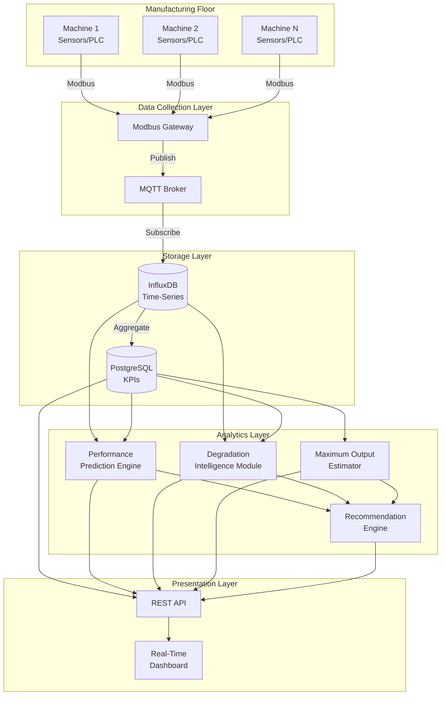

# Design Document: AI-Driven Industry 4.0 Performance Acceleration System

## Overview

The AI-Driven Industry 4.0 Performance Acceleration System is a comprehensive IoT and ML-based solution that transforms aging MSME manufacturing infrastructure into smart, data-driven production facilities. The system follows a layered architecture with clear separation between data collection, storage, analytics, and presentation layers.

The core design philosophy emphasizes:
- Non-invasive integration with existing equipment
- Real-time data processing with sub-second latency
- Scalable ML pipeline supporting multiple regression algorithms
- Fault-tolerant operation with graceful degradation
- Intuitive visualization for non-technical operators

## Architecture

### System Architecture Diagram



### Architectural Layers

**1. Data Collection Layer**
- Modbus Gateway: Polls sensors/PLCs at configurable intervals (default 1 second)
- MQTT Broker: Provides pub/sub messaging for real-time data distribution
- Handles protocol translation from industrial (Modbus) to IoT (MQTT)

**2. Storage Layer**
- InfluxDB: Optimized for time-series sensor data with automatic retention policies
- PostgreSQL: Stores aggregated KPIs, configuration, user data, and ML model metadata
- Data flows from raw (InfluxDB) to aggregated (PostgreSQL) every 5 minutes

**3. Analytics Layer**
- Four specialized ML/AI modules operating independently
- Each module reads from storage, processes, and writes results back
- Modules can be scaled independently based on computational needs

**4. Presentation Layer**
- REST API: Provides unified interface to all system capabilities
- Dashboard: React-based SPA with WebSocket for real-time updates
- Supports multiple concurrent users with role-based views

### Technology Stack

**Data Collection & Messaging:**
- Modbus: pymodbus (Python library for Modbus TCP/RTU)
- MQTT: Eclipse Mosquitto broker, paho-mqtt client library
- Message format: JSON with schema validation

**Storage:**
- InfluxDB 2.x: Time-series database with Flux query language
- PostgreSQL 14+: Relational database with TimescaleDB extension for hybrid workloads
- Connection pooling: pgbouncer for PostgreSQL, InfluxDB client connection pooling

**ML/Analytics:**
- Python 3.10+ with scikit-learn for ML models
- pandas for data manipulation
- numpy for numerical computations
- statsmodels for time-series analysis and statistical tests
- Model serialization: joblib for model persistence

**API & Dashboard:**
- FastAPI (Python) for REST API with automatic OpenAPI documentation
- React 18+ with TypeScript for dashboard
- Chart.js or Recharts for data visualization
- WebSocket (Socket.io) for real-time updates
- Authentication: JWT tokens with refresh mechanism

**Infrastructure:**
- Docker containers for all services
- Docker Compose for local development
- Kubernetes-ready for production scaling
- Nginx as reverse proxy and load balancer

## Components and Interfaces

### 1. Modbus Gateway Service

**Responsibility:** Poll manufacturing equipment and publish sensor data to MQTT.

**Key Classes:**

```python
class ModbusDevice:
    """Represents a single Modbus-connected device"""
    device_id: str
    host: str
    port: int
    unit_id: int
    registers: List[RegisterMapping]
    poll_interval: float  # seconds
    
    def connect() -> bool
    def read_registers() -> Dict[str, float]
    def disconnect() -> None

class RegisterMapping:
    """Maps Modbus register to sensor metric"""
    register_address: int
    register_type: str  # 'holding', 'input', 'coil'
    metric_name: str
    data_type: str  # 'int16', 'float32', etc.
    scale_factor: float
    unit: str

class ModbusGateway:
    """Manages multiple Modbus devices and publishes to MQTT"""
    devices: List[ModbusDevice]
    mqtt_client: MQTTClient
    
    def start() -> None
    def stop() -> None
    def poll_device(device: ModbusDevice) -> None
    def publish_reading(device_id: str, data: Dict) -> None
```

**Interface:**
- Input: Modbus TCP/RTU from PLCs/sensors
- Output: MQTT messages to topic `machines/{machine_id}/sensors`
- Configuration: JSON file with device definitions

**Message Format (MQTT):**
```json
{
  "machine_id": "CNC-001",
  "timestamp": "2024-01-15T10:30:45.123Z",
  "metrics": {
    "spindle_speed": 3500.0,
    "temperature": 65.2,
    "vibration": 0.8,
    "power_consumption": 12.5,
    "cycle_time": 45.2
  }
}
```

### 2. Data Ingestion Service

**Responsibility:** Subscribe to MQTT, validate, and store data in InfluxDB.

**Key Classes:**

```python
class DataIngestionService:
    """Subscribes to MQTT and writes to InfluxDB"""
    mqtt_client: MQTTClient
    influx_client: InfluxDBClient
    buffer: CircularBuffer  # For fault tolerance
    
    def start() -> None
    def on_message(topic: str, payload: bytes) -> None
    def validate_message(data: Dict) -> bool
    def write_to_influx(data: Dict) -> None
    def flush_buffer() -> None

class CircularBuffer:
    """In-memory buffer for fault tolerance"""
    max_size: int  # 1 hour of data
    buffer: Deque[Dict]
    
    def add(data: Dict) -> None
    def flush_to_storage(storage: InfluxDBClient) -> int
    def is_full() -> bool
```

**Interface:**
- Input: MQTT messages from `machines/+/sensors`
- Output: InfluxDB writes to measurement `sensor_data`
- Error handling: Buffer in memory if InfluxDB unavailable

**InfluxDB Schema:**
```
measurement: sensor_data
tags:
  - machine_id
  - facility_id (optional)
fields:
  - spindle_speed (float)
  - temperature (float)
  - vibration (float)
  - power_consumption (float)
  - cycle_time (float)
  - [other metrics]
timestamp: nanosecond precision
```

### 3. KPI Aggregation Service

**Responsibility:** Compute and store aggregated KPIs in PostgreSQL.

**Key Classes:**

```python
class KPIAggregator:
    """Aggregates time-series data into KPIs"""
    influx_client: InfluxDBClient
    postgres_conn: PostgreSQLConnection
    aggregation_interval: int  # seconds (default 300)
    
    def run_aggregation_cycle() -> None
    def compute_efficiency(machine_id: str, window: TimeWindow) -> float
    def compute_output_rate(machine_id: str, window: TimeWindow) -> float
    def compute_energy_metrics(machine_id: str, window: TimeWindow) -> Dict
    def store_kpis(kpis: List[KPI]) -> None

class KPI:
    """Represents a calculated KPI"""
    machine_id: str
    timestamp: datetime
    metric_name: str
    value: float
    unit: str
    aggregation_window: str  # '5min', '1hour', '1day'
```

**PostgreSQL Schema:**

```sql
CREATE TABLE machines (
    machine_id VARCHAR(50) PRIMARY KEY,
    facility_id VARCHAR(50),
    machine_type VARCHAR(100),
    rated_capacity FLOAT,
    installation_date DATE,
    config JSONB
);

CREATE TABLE kpis (
    id SERIAL PRIMARY KEY,
    machine_id VARCHAR(50) REFERENCES machines(machine_id),
    timestamp TIMESTAMPTZ NOT NULL,
    metric_name VARCHAR(100) NOT NULL,
    value FLOAT NOT NULL,
    unit VARCHAR(20),
    aggregation_window VARCHAR(20),
    INDEX idx_machine_time (machine_id, timestamp DESC),
    INDEX idx_metric (metric_name, timestamp DESC)
);

CREATE TABLE alerts (
    id SERIAL PRIMARY KEY,
    machine_id VARCHAR(50) REFERENCES machines(machine_id),
    alert_type VARCHAR(50) NOT NULL,
    severity VARCHAR(20) NOT NULL,
    message TEXT,
    created_at TIMESTAMPTZ DEFAULT NOW(),
    resolved_at TIMESTAMPTZ,
    acknowledged_by VARCHAR(100),
    status VARCHAR(20) DEFAULT 'open'
);
```

### 4. Performance Prediction Engine

**Responsibility:** Train and serve ML models for production output forecasting.

**Key Classes:**

```python
class PerformancePredictionEngine:
    """Manages ML models for output prediction"""
    models: Dict[str, MLModel]  # model_name -> model
    feature_engineer: FeatureEngineer
    model_registry: ModelRegistry
    
    def train_models(machine_id: str, training_data: DataFrame) -> Dict[str, float]
    def predict(machine_id: str, current_state: Dict) -> Prediction
    def evaluate_models(validation_data: DataFrame) -> Dict[str, Metrics]
    def select_best_model() -> str

class MLModel:
    """Wrapper for scikit-learn models"""
    model_type: str  # 'linear', 'random_forest', 'gradient_boosting'
    model: Any  # sklearn model instance
    hyperparameters: Dict
    performance_metrics: Dict
    trained_at: datetime
    
    def fit(X: DataFrame, y: Series) -> None
    def predict(X: DataFrame) -> ndarray
    def get_feature_importance() -> Dict[str, float]

class FeatureEngineer:
    """Transforms raw data into ML features"""
    def extract_features(raw_data: DataFrame) -> DataFrame
    def create_lag_features(data: DataFrame, lags: List[int]) -> DataFrame
    def create_rolling_features(data: DataFrame, windows: List[int]) -> DataFrame
    def encode_categorical(data: DataFrame) -> DataFrame

class Prediction:
    """Prediction result with confidence intervals"""
    predicted_output: float
    confidence_interval_lower: float
    confidence_interval_upper: float
    confidence_level: float
    model_used: str
    features_used: Dict[str, float]
```

**ML Pipeline:**

1. **Feature Engineering:**
   - Current metrics: spindle_speed, temperature, vibration, power, cycle_time
   - Lag features: previous 1, 5, 15 minute values
   - Rolling statistics: mean, std, min, max over 15min, 1hour windows
   - Time features: hour_of_day, day_of_week, shift_number
   - Machine metadata: age, rated_capacity, maintenance_days_since

2. **Model Training:**
   - Train three models: Linear Regression, Random Forest, Gradient Boosting
   - Use 80/20 train/validation split
   - Hyperparameter tuning with cross-validation
   - Select best model based on MAPE on validation set
   - Retrain daily with rolling window of last 30 days

3. **Prediction Serving:**
   - Real-time prediction API endpoint
   - Feature extraction from current state
   - Model inference with confidence intervals (bootstrap method)
   - Cache predictions for 1 minute to reduce computation

**Model Evaluation Metrics:**
- MAPE (Mean Absolute Percentage Error): Target <10%
- RMSE (Root Mean Squared Error)
- R² (Coefficient of Determination): Target >0.85
- Prediction latency: Target <2 seconds

### 5. Degradation Intelligence Module

**Responsibility:** Detect performance degradation using time-series analysis.

**Key Classes:**

```python
class DegradationDetector:
    """Detects performance degradation trends"""
    lookback_days: int  # default 7
    confidence_threshold: float  # default 0.90
    
    def analyze_trends(machine_id: str, metrics: List[str]) -> List[DegradationAlert]
    def detect_trend(time_series: Series) -> TrendAnalysis
    def calculate_degradation_rate(time_series: Series) -> float
    def correlate_metrics(metrics_data: DataFrame) -> Dict[str, List[str]]

class TrendAnalysis:
    """Result of trend detection"""
    metric_name: str
    trend_direction: str  # 'increasing', 'decreasing', 'stable'
    trend_strength: float  # 0.0 to 1.0
    confidence: float
    degradation_rate: float  # percentage per day
    statistical_test: str  # 'mann_kendall', 'linear_regression'
    p_value: float

class DegradationAlert:
    """Alert for detected degradation"""
    machine_id: str
    affected_metrics: List[str]
    degradation_rate: float
    confidence: float
    potential_causes: List[str]
    recommended_actions: List[str]
```

**Degradation Detection Algorithm:**

1. **Data Preparation:**
   - Query last 7 days of KPI data for machine
   - Resample to hourly averages to reduce noise
   - Handle missing data with forward fill (max 2 hours)

2. **Trend Detection:**
   - Apply Mann-Kendall test for monotonic trends
   - Fit linear regression to quantify trend slope
   - Calculate confidence using p-value from statistical test
   - Flag as degradation if: downward trend AND p-value <0.10

3. **Degradation Rate Calculation:**
   - Compute percentage change per day from regression slope
   - Normalize by metric's historical mean
   - Express as percentage decline per day

4. **Root Cause Correlation:**
   - Analyze correlation matrix of all metrics
   - Identify metrics degrading simultaneously
   - Match patterns against known failure modes
   - Generate potential cause hypotheses

5. **Alert Generation:**
   - Create alert if confidence >90%
   - Include affected metrics, rate, and recommendations
   - Store in alerts table with severity based on rate

### 6. Maximum Output Estimator

**Responsibility:** Calculate realistic maximum achievable production output.

**Key Classes:**

```python
class MaximumOutputEstimator:
    """Estimates maximum achievable output"""
    def estimate_maximum(machine_id: str, horizon: str) -> MaxOutputEstimate
    def calculate_physical_limits(machine: Machine) -> Dict[str, float]
    def adjust_for_degradation(base_max: float, degradation: float) -> float
    def calculate_confidence_bounds(estimates: List[float]) -> Tuple[float, float]

class MaxOutputEstimate:
    """Maximum output estimate with confidence bounds"""
    machine_id: str
    short_term_max: float  # 1 hour peak
    sustained_max: float  # 8 hour shift
    long_term_max: float  # weekly average
    confidence_lower: float
    confidence_upper: float
    confidence_level: float
    limiting_factors: List[str]
    updated_at: datetime
```

**Estimation Algorithm:**

1. **Baseline Maximum:**
   - Start with rated capacity from machine specifications
   - Adjust for machine age using depreciation curve
   - Factor in historical peak performance (95th percentile)

2. **Degradation Adjustment:**
   - Query current degradation rate from Degradation Module
   - Apply degradation factor: adjusted_max = baseline * (1 - degradation_rate)
   - Consider maintenance history (recent maintenance increases max)

3. **Time Horizon Adjustment:**
   - Short-term (1 hour): Allow 110% of adjusted baseline (burst capacity)
   - Sustained (8 hours): Use 95% of adjusted baseline (thermal limits)
   - Long-term (weekly): Use 85% of adjusted baseline (maintenance, variability)

4. **Confidence Bounds:**
   - Calculate historical variance in peak performance
   - Use bootstrap resampling of historical peaks
   - Compute 90% confidence interval

5. **Limiting Factor Identification:**
   - Analyze which metric is closest to its limit
   - Common factors: thermal (temperature), mechanical (vibration), electrical (power)
   - Report top 3 limiting factors

### 7. Recommendation Engine

**Responsibility:** Generate actionable optimization recommendations.

**Key Classes:**

```python
class RecommendationEngine:
    """Generates optimization recommendations"""
    rule_engine: RuleEngine
    data_driven_engine: DataDrivenEngine
    ranker: RecommendationRanker
    
    def generate_recommendations(machine_id: str) -> List[Recommendation]
    def rank_recommendations(recommendations: List[Recommendation]) -> List[Recommendation]
    def track_implementation(recommendation_id: str, outcome: Dict) -> None

class Recommendation:
    """Single optimization recommendation"""
    recommendation_id: str
    machine_id: str
    category: str  # 'settings', 'maintenance', 'energy', 'scheduling'
    title: str
    description: str
    expected_improvement: float  # percentage
    implementation_difficulty: str  # 'low', 'medium', 'high'
    estimated_cost: float
    priority_score: float
    supporting_data: Dict
    created_at: datetime

class RuleEngine:
    """Rule-based recommendation generation"""
    rules: List[Rule]
    
    def evaluate_rules(machine_state: Dict) -> List[Recommendation]

class DataDrivenEngine:
    """ML-based recommendation generation"""
    optimization_model: MLModel
    
    def find_optimal_settings(current_state: Dict, target: str) -> Dict[str, float]
    def simulate_changes(current_state: Dict, changes: Dict) -> float
```

**Recommendation Generation Process:**

1. **Rule-Based Recommendations:**
   - IF efficiency <70% AND temperature >80°C THEN "Reduce operating speed by 10%"
   - IF vibration increasing >5% per day THEN "Schedule bearing inspection"
   - IF idle_time >20% THEN "Optimize production scheduling"
   - IF power_consumption >baseline +15% THEN "Check for mechanical resistance"

2. **Data-Driven Recommendations:**
   - Train optimization model on historical data
   - Find settings that historically achieved high efficiency
   - Use gradient-based optimization to find optimal parameter combinations
   - Validate recommendations don't violate safety constraints

3. **Recommendation Ranking:**
   - Score = (expected_improvement * 0.4) + (ease_of_implementation * 0.3) + (cost_effectiveness * 0.3)
   - Filter to top 5 recommendations per machine
   - Ensure diversity across categories

4. **Implementation Tracking:**
   - When operator marks recommendation as implemented
   - Monitor metrics for 24 hours post-implementation
   - Calculate actual improvement vs predicted
   - Update recommendation models with outcomes

### 8. REST API Service

**Responsibility:** Provide unified HTTP interface to all system capabilities.

**Key Endpoints:**

```python
# Machine Management
GET    /api/v1/machines
GET    /api/v1/machines/{machine_id}
POST   /api/v1/machines
PUT    /api/v1/machines/{machine_id}
DELETE /api/v1/machines/{machine_id}

# Real-time Data
GET    /api/v1/machines/{machine_id}/current
GET    /api/v1/machines/{machine_id}/metrics?start=<ts>&end=<ts>&metrics=<list>

# KPIs
GET    /api/v1/machines/{machine_id}/kpis?window=<5min|1hour|1day>
GET    /api/v1/machines/{machine_id}/efficiency

# Predictions
GET    /api/v1/machines/{machine_id}/predictions
POST   /api/v1/machines/{machine_id}/predictions/refresh

# Degradation
GET    /api/v1/machines/{machine_id}/degradation
GET    /api/v1/machines/{machine_id}/health-score

# Maximum Output
GET    /api/v1/machines/{machine_id}/maximum-output

# Recommendations
GET    /api/v1/machines/{machine_id}/recommendations
POST   /api/v1/recommendations/{rec_id}/implement
POST   /api/v1/recommendations/{rec_id}/dismiss

# Alerts
GET    /api/v1/alerts?status=<open|resolved>&severity=<info|warning|critical>
PUT    /api/v1/alerts/{alert_id}/acknowledge
PUT    /api/v1/alerts/{alert_id}/resolve

# Historical Data
GET    /api/v1/machines/{machine_id}/history?start=<ts>&end=<ts>&metrics=<list>
GET    /api/v1/machines/{machine_id}/export?format=<csv|json>&start=<ts>&end=<ts>

# Model Management
GET    /api/v1/models/{machine_id}
POST   /api/v1/models/{machine_id}/train
GET    /api/v1/models/{machine_id}/performance

# Authentication
POST   /api/v1/auth/login
POST   /api/v1/auth/refresh
POST   /api/v1/auth/logout

# WebSocket
WS     /api/v1/ws/machines/{machine_id}  # Real-time updates
```

**Authentication & Authorization:**
- JWT-based authentication with access and refresh tokens
- Role-based access control (RBAC)
- Roles: operator (read-only), supervisor (read + acknowledge), admin (full access)
- Token expiry: access token 15 minutes, refresh token 7 days

### 9. Real-Time Dashboard

**Responsibility:** Visualize system data and enable user interactions.

**Key Components:**

```typescript
// Main Dashboard Views
interface DashboardView {
  OverviewPage: React.FC;           // Multi-machine summary
  MachineDetailPage: React.FC;      // Single machine deep-dive
  AlertsPage: React.FC;             // Alert management
  RecommendationsPage: React.FC;    // Optimization suggestions
  HistoricalAnalysisPage: React.FC; // Trend analysis
  AdminPage: React.FC;              // Configuration
}

// Real-time Data Hook
function useRealtimeData(machineId: string) {
  const [data, setData] = useState<MachineData>();
  
  useEffect(() => {
    const ws = new WebSocket(`/api/v1/ws/machines/${machineId}`);
    ws.onmessage = (event) => setData(JSON.parse(event.data));
    return () => ws.close();
  }, [machineId]);
  
  return data;
}

// Key Visualizations
interface Visualizations {
  EfficiencyGauge: React.FC<{value: number}>;
  OutputComparisonChart: React.FC<{actual: number[], predicted: number[]}>;
  TrendLineChart: React.FC<{timeSeries: TimeSeries[]}>;
  DegradationHeatmap: React.FC<{machines: Machine[]}>;
  RecommendationCard: React.FC<{recommendation: Recommendation}>;
  AlertNotification: React.FC<{alert: Alert}>;
}
```

**Dashboard Features:**

1. **Overview Page:**
   - Grid of machine cards showing current status
   - Color-coded efficiency indicators (green >80%, yellow 60-80%, red <60%)
   - Active alerts count per machine
   - Facility-level aggregated metrics

2. **Machine Detail Page:**
   - Real-time metrics with 5-second refresh
   - Actual vs predicted output comparison chart
   - Efficiency trend over selectable time periods
   - Current recommendations panel
   - Degradation indicators with drill-down

3. **Alerts Page:**
   - Filterable alert list (status, severity, machine)
   - Alert details with recommended actions
   - Acknowledge and resolve actions
   - Alert history timeline

4. **Recommendations Page:**
   - Ranked list of active recommendations
   - Expected impact visualization
   - Implementation tracking
   - Historical recommendation outcomes

## Data Models

### Core Data Structures

**Machine Configuration:**
```python
@dataclass
class MachineConfig:
    machine_id: str
    facility_id: str
    machine_type: str
    manufacturer: str
    model: str
    installation_date: date
    rated_capacity: float
    rated_capacity_unit: str
    modbus_config: ModbusConfig
    sensor_mappings: List[SensorMapping]
    operational_parameters: Dict[str, Any]
    maintenance_schedule: MaintenanceSchedule
```

**Sensor Reading:**
```python
@dataclass
class SensorReading:
    machine_id: str
    timestamp: datetime
    metrics: Dict[str, float]  # metric_name -> value
    quality: str  # 'good', 'uncertain', 'bad'
```

**KPI Record:**
```python
@dataclass
class KPIRecord:
    machine_id: str
    timestamp: datetime
    metric_name: str
    value: float
    unit: str
    aggregation_window: str
    metadata: Dict[str, Any]
```

**Prediction Result:**
```python
@dataclass
class PredictionResult:
    machine_id: str
    timestamp: datetime
    predicted_output: float
    confidence_interval: Tuple[float, float]
    confidence_level: float
    model_name: str
    model_version: str
    features: Dict[str, float]
    prediction_horizon: str  # '1hour', '4hour', '8hour'
```

**Alert:**
```python
@dataclass
class Alert:
    alert_id: str
    machine_id: str
    alert_type: str
    severity: str  # 'info', 'warning', 'critical'
    title: str
    message: str
    created_at: datetime
    resolved_at: Optional[datetime]
    acknowledged_by: Optional[str]
    acknowledged_at: Optional[datetime]
    status: str  # 'open', 'acknowledged', 'resolved'
    metadata: Dict[str, Any]
```

### Data Flow

1. **Sensor Data Flow:**
   ```
   Machine → Modbus → Gateway → MQTT → Ingestion Service → InfluxDB
   ```

2. **KPI Calculation Flow:**
   ```
   InfluxDB → Aggregation Service → PostgreSQL (kpis table)
   ```

3. **Prediction Flow:**
   ```
   PostgreSQL (kpis) → Feature Engineering → ML Model → Prediction → PostgreSQL (predictions table)
   ```

4. **Alert Flow:**
   ```
   Degradation Detector → Alert → PostgreSQL (alerts table) → WebSocket → Dashboard
   ```

5. **Recommendation Flow:**
   ```
   [Predictions + Degradation + Max Output] → Recommendation Engine → PostgreSQL (recommendations table) → API → Dashboard
   ```

## Correctness Properties

*A property is a characteristic or behavior that should hold true across all valid executions of a system—essentially, a formal statement about what the system should do. Properties serve as the bridge between human-readable specifications and machine-verifiable correctness guarantees.*


### Property 1: Modbus Data Parsing Correctness
*For any* valid Modbus message conforming to the configured register mappings, parsing should extract all metric values correctly without data loss or corruption.
**Validates: Requirements 1.1**

### Property 2: MQTT Publishing Completeness
*For any* sensor reading received from Modbus, the system should publish a corresponding MQTT message containing all metrics from the original reading.
**Validates: Requirements 1.2**

### Property 3: Time-Series Storage Round-Trip
*For any* sensor data published to MQTT, storing it in InfluxDB and then querying it back should preserve all metric values and timestamp precision to the millisecond.
**Validates: Requirements 1.3**

### Property 4: Retry Logic with Exponential Backoff
*For any* sensor data transmission failure, the system should attempt exactly 3 retries with exponentially increasing delays before giving up.
**Validates: Requirements 1.5**

### Property 5: KPI Aggregation Correctness
*For any* time window of raw sensor data, aggregating it into KPIs should produce values that match manual calculation of the same aggregation functions (mean, sum, count, etc.).
**Validates: Requirements 1.6**

### Property 6: Prediction Feature Completeness
*For any* prediction request, the feature extraction should include all 5 required features (machine speed, temperature, vibration, power consumption, material properties).
**Validates: Requirements 2.3**

### Property 7: Prediction Confidence Intervals
*For any* prediction generated by the Performance Prediction Engine, the result should include both lower and upper confidence bounds with a specified confidence level.
**Validates: Requirements 2.6**

### Property 8: Efficiency Score Calculation
*For any* actual output value and rated capacity, the efficiency score should equal (actual / rated) * 100, correctly handling the mathematical relationship.
**Validates: Requirements 3.1**

### Property 9: Efficiency Score Capping
*For any* actual output that exceeds rated capacity, the efficiency score should be capped at exactly 100% and a flag should be set indicating over-capacity operation.
**Validates: Requirements 3.3**

### Property 10: Efficiency Aggregation Completeness
*For any* machine at any point in time, the efficiency metrics should include all four required aggregation levels (current, hourly average, daily average, weekly average).
**Validates: Requirements 3.4**

### Property 11: Missing Data Handling
*For any* efficiency calculation where actual output data is missing or invalid, the system should mark the score as unavailable and use the last valid value for trend calculations.
**Validates: Requirements 3.5**

### Property 12: Trend Detection Accuracy
*For any* synthetic time-series with a known downward trend of statistical significance, the Degradation Intelligence Module should detect the trend with confidence matching the statistical test p-value.
**Validates: Requirements 4.1**

### Property 13: Degradation Alert Generation
*For any* detected performance degradation with confidence ≥90%, the system should generate an alert containing the affected machine, degradation rate, and confidence level.
**Validates: Requirements 4.3**

### Property 14: Degradation Rate Quantification
*For any* time-series showing performance decline, the calculated degradation rate should accurately represent the percentage decline per day based on the trend slope.
**Validates: Requirements 4.4**

### Property 15: Multi-Metric Degradation Correlation
*For any* set of metrics where multiple metrics degrade simultaneously, the system should identify the correlation and flag it as a potential systemic issue.
**Validates: Requirements 4.5**

### Property 16: Variance vs Degradation Distinction
*For any* time-series with normal operational variance (no trend), the system should not flag it as degradation, distinguishing random fluctuation from genuine decline.
**Validates: Requirements 4.6**

### Property 17: Maximum Output Calculation
*For any* machine with known parameters (age, rated capacity, degradation level), the Maximum Output Estimator should produce a non-negative value less than or equal to the rated capacity adjusted for age.
**Validates: Requirements 5.1**

### Property 18: Physical Constraints Consideration
*For any* two machines with identical rated capacity but different ages or degradation levels, the machine with greater age or degradation should have a lower or equal maximum output estimate.
**Validates: Requirements 5.2**

### Property 19: Multi-Horizon Output Estimates
*For any* maximum output estimation, the result should include all three time horizons (short-term peak, sustained, long-term) with short-term ≥ sustained ≥ long-term.
**Validates: Requirements 5.3**

### Property 20: Overload Alert Threshold
*For any* machine where actual output reaches or exceeds 95% of estimated maximum, the system should generate an overload warning alert.
**Validates: Requirements 5.5**

### Property 21: Maximum Output Confidence Bounds
*For any* maximum output estimate, the result should include confidence bounds (lower and upper) with a specified confidence level (90%).
**Validates: Requirements 5.6**

### Property 22: Recommendation Ranking
*For any* set of generated recommendations, they should be ordered by priority score in descending order (highest priority first).
**Validates: Requirements 6.1**

### Property 23: Recommendation Structure Completeness
*For any* generated recommendation, it should include all required fields: expected improvement percentage, implementation difficulty level, and estimated cost.
**Validates: Requirements 6.3**

### Property 24: Recommendation Category Diversity
*For any* machine with sufficient operational data, the generated recommendations should span at least 4 distinct categories (settings, maintenance, energy, scheduling).
**Validates: Requirements 6.4**

### Property 25: Recommendation Implementation Tracking
*For any* recommendation marked as implemented, the system should create a tracking record and monitor the affected metrics for outcome measurement.
**Validates: Requirements 6.5**

### Property 26: Recommendation Count Limit
*For any* machine at any point in time, the number of active recommendations should never exceed 5.
**Validates: Requirements 6.6**

### Property 27: Dashboard Data Completeness
*For any* dashboard view, the production data should include both actual and predicted output values for comparison.
**Validates: Requirements 7.3**

### Property 28: Multi-Period Trend Data Availability
*For any* key metric (efficiency, output rate, energy consumption), the system should provide trend data for all selectable time periods (hour, day, week, month).
**Validates: Requirements 7.4**

### Property 29: Alert Visibility in Dashboard
*For any* active alert in the system, it should appear in the dashboard data with its severity level clearly indicated.
**Validates: Requirements 7.5**

### Property 30: Multi-Facility Aggregation
*For any* operator with machines across multiple facilities, facility-level aggregated metrics should equal the sum/average of individual machine metrics within that facility.
**Validates: Requirements 7.7**

### Property 31: Data Downsampling Preservation
*For any* time-series data that undergoes downsampling, the downsampled version should preserve key statistical properties (mean, min, max) of the original data within the downsampling window.
**Validates: Requirements 8.4**

### Property 32: Historical Data Export Round-Trip
*For any* historical data exported to CSV or JSON format, parsing the exported file should reconstruct the original data with all metrics and timestamps intact.
**Validates: Requirements 8.5**

### Property 33: Train-Test Split Proportion
*For any* model training operation, the data should be split such that training data comprises 80% (±1%) and validation data comprises 20% (±1%) of the total dataset.
**Validates: Requirements 9.1**

### Property 34: Model Evaluation Metrics Completeness
*For any* trained model evaluation, the results should include all three required metrics: MAPE, RMSE, and R-squared.
**Validates: Requirements 9.2**

### Property 35: Model Selection Based on Performance
*For any* newly trained model that performs worse than the current production model (higher MAPE or lower R²), the system should retain the current model and reject the new one.
**Validates: Requirements 9.3**

### Property 36: Manual Retraining Completion
*For any* administrator-triggered manual retraining request with valid parameters, the system should complete the training and return success or failure status.
**Validates: Requirements 9.4**

### Property 37: Model Versioning Completeness
*For any* saved ML model, the model metadata should include version number, timestamp, and performance metrics for traceability.
**Validates: Requirements 9.6**

### Property 38: Machine Configuration Completeness
*For any* new machine added to the system, the configuration should include all required fields: rated capacity, sensor mappings, and operational parameters.
**Validates: Requirements 10.1**

### Property 39: Configuration Validation
*For any* configuration change with invalid values (negative capacity, invalid sensor addresses, etc.), the system should reject the change and return a descriptive error.
**Validates: Requirements 10.2**

### Property 40: Configuration Audit Logging
*For any* configuration change saved to the system, an audit log entry should be created containing timestamp, user identifier, and description of the change.
**Validates: Requirements 10.4**

### Property 41: Machine Type Template Support
*For any* supported machine type, the system should provide a configuration template that can be loaded and applied to new machines of that type.
**Validates: Requirements 10.5**

### Property 42: Configuration Backup-Restore Round-Trip
*For any* system configuration, backing it up and then restoring from the backup should produce an equivalent configuration with all settings preserved.
**Validates: Requirements 10.6**

### Property 43: Critical Condition Alert Generation
*For any* critical condition (efficiency drop >20%, degradation alert, predicted failure), the system should generate an alert with appropriate severity level.
**Validates: Requirements 11.1**

### Property 44: Multi-Channel Notification Routing
*For any* alert with configured notification channels, the alert should be sent to all configured channels (dashboard, email, SMS) based on alert type configuration.
**Validates: Requirements 11.2**

### Property 45: Alert Structure Completeness
*For any* generated alert, it should include all required fields: severity level, affected machine ID, description, and recommended actions.
**Validates: Requirements 11.3**

### Property 46: Alert Throttling
*For any* alert condition that triggers multiple times within a 15-minute window, only the first alert should be sent, with subsequent duplicates suppressed until the window expires.
**Validates: Requirements 11.4**

### Property 47: Automatic Alert Resolution
*For any* alert whose triggering condition is no longer true, the system should automatically update the alert status to resolved and notify relevant users.
**Validates: Requirements 11.5**

### Property 48: Energy Efficiency Metrics Calculation
*For any* machine with power consumption and production output data, the system should correctly calculate energy per unit produced, idle power consumption, and identify peak power events.
**Validates: Requirements 12.2**

### Property 49: Energy Threshold Alert
*For any* machine where energy consumption exceeds baseline by more than 15%, the system should generate an alert and flag the condition for investigation.
**Validates: Requirements 12.3**

### Property 50: Energy Recommendation Generation
*For any* machine with energy optimization opportunities, the Recommendation Engine should generate at least one recommendation in the energy efficiency category.
**Validates: Requirements 12.4**

### Property 51: Energy Cost Calculation
*For any* energy consumption value and configured electricity rate, the cost estimate should equal consumption multiplied by rate, correctly handling unit conversions.
**Validates: Requirements 12.5**

### Property 52: Energy-Output Correlation Analysis
*For any* machine with sufficient operational data, the system should identify the operating point (speed, load) that minimizes energy per unit produced.
**Validates: Requirements 12.6**

### Property 53: Authentication Enforcement
*For any* API request without valid authentication credentials, the system should reject the request with a 401 Unauthorized status.
**Validates: Requirements 13.1**

### Property 54: Role-Based Authorization
*For any* user with a specific role (Operator, Supervisor, Administrator), the system should allow only the actions permitted for that role and deny all others.
**Validates: Requirements 13.2**

### Property 55: Unauthorized Action Logging
*For any* attempt to perform an unauthorized action, the system should deny access, return an error, and create an audit log entry of the attempt.
**Validates: Requirements 13.3**

### Property 56: Password Complexity Validation
*For any* password that doesn't meet complexity requirements (minimum 8 characters, mixed case, numbers, special characters), the system should reject it with a descriptive error.
**Validates: Requirements 13.4**

### Property 57: User Action Audit Logging
*For any* user action (login, configuration change, alert acknowledgment), the system should create an audit log entry with user ID, action type, and timestamp.
**Validates: Requirements 13.7**

### Property 58: Database Unavailability Buffering
*For any* sensor data received when the Time-Series Database is unavailable, the system should buffer the data in memory and successfully flush it to storage when the database becomes available again.
**Validates: Requirements 14.1**

### Property 59: Prediction Service Graceful Degradation
*For any* period when the ML prediction service is unavailable, the system should continue displaying historical data and alerts without crashing or losing functionality.
**Validates: Requirements 14.2**

### Property 60: Component Failure Detection and Recovery
*For any* critical component failure detected by health checks, the system should generate an administrator alert and attempt automatic recovery procedures.
**Validates: Requirements 14.4**

### Property 61: Network Reconnection
*For any* network interruption that disconnects data collection, the system should automatically reconnect when network connectivity is restored and resume data collection without manual intervention.
**Validates: Requirements 14.6**

### Property 62: Modbus Device Discovery
*For any* Modbus device configured in the system and available on the network, the automatic discovery process should successfully identify and list the device.
**Validates: Requirements 15.2**

### Property 63: System Load Alert
*For any* system state where computational load exceeds 80% of capacity, the system should generate an alert to administrators with scaling recommendations.
**Validates: Requirements 15.4**

## Error Handling

### Error Categories

**1. Data Collection Errors:**
- Modbus communication failures (timeout, invalid response, connection refused)
- MQTT broker unavailability
- Sensor data validation failures (out-of-range values, malformed messages)

**Error Handling Strategy:**
- Retry with exponential backoff (up to 3 attempts)
- Log all failures with context (device ID, error type, timestamp)
- Buffer data in memory during transient failures
- Alert administrators for persistent failures (>5 minutes)

**2. Storage Errors:**
- InfluxDB write failures (connection timeout, disk full, authentication failure)
- PostgreSQL connection pool exhaustion
- Query timeouts

**Error Handling Strategy:**
- Implement circuit breaker pattern for database connections
- Buffer writes in memory (up to 1 hour of data)
- Degrade gracefully: continue monitoring even if storage fails
- Automatic retry with backoff
- Alert administrators immediately for storage failures

**3. ML Model Errors:**
- Insufficient training data
- Model training failures (convergence issues, numerical instability)
- Prediction errors (invalid input features, model not loaded)
- Model performance degradation

**Error Handling Strategy:**
- Use default/fallback models when training fails
- Validate input features before prediction
- Return error responses with clear messages for API calls
- Monitor model performance continuously
- Alert administrators when model performance drops below threshold

**4. API Errors:**
- Invalid request parameters
- Authentication/authorization failures
- Rate limiting exceeded
- Downstream service unavailability

**Error Handling Strategy:**
- Return standard HTTP error codes with descriptive messages
- Implement request validation with detailed error responses
- Use circuit breakers for downstream services
- Provide fallback responses when possible (cached data, historical averages)

**5. Configuration Errors:**
- Invalid machine configuration
- Sensor mapping errors
- Missing required parameters

**Error Handling Strategy:**
- Validate all configuration changes before applying
- Provide detailed validation error messages
- Maintain configuration history for rollback
- Prevent system startup with invalid configuration

### Error Response Format

All API errors follow a consistent JSON structure:

```json
{
  "error": {
    "code": "ERROR_CODE",
    "message": "Human-readable error description",
    "details": {
      "field": "specific_field_name",
      "reason": "Detailed reason for failure"
    },
    "timestamp": "2024-01-15T10:30:45.123Z",
    "request_id": "uuid-for-tracing"
  }
}
```

### Logging Strategy

**Log Levels:**
- DEBUG: Detailed diagnostic information (disabled in production)
- INFO: Normal operational events (data collection, predictions generated)
- WARNING: Unexpected but handled situations (retries, fallback to defaults)
- ERROR: Errors that require attention (failed operations, degraded functionality)
- CRITICAL: System-wide failures requiring immediate action

**Structured Logging:**
All logs use JSON format with consistent fields:
```json
{
  "timestamp": "2024-01-15T10:30:45.123Z",
  "level": "ERROR",
  "service": "modbus-gateway",
  "machine_id": "CNC-001",
  "message": "Modbus connection timeout",
  "error_code": "MODBUS_TIMEOUT",
  "context": {
    "host": "192.168.1.100",
    "port": 502,
    "retry_attempt": 2
  }
}
```

## Testing Strategy

### Dual Testing Approach

The system requires both unit testing and property-based testing for comprehensive coverage:

**Unit Tests:**
- Specific examples demonstrating correct behavior
- Edge cases and boundary conditions
- Integration points between components
- Error conditions and exception handling
- Mock external dependencies (databases, MQTT, Modbus devices)

**Property-Based Tests:**
- Universal properties that hold for all inputs
- Comprehensive input coverage through randomization
- Minimum 100 iterations per property test
- Each property test references its design document property
- Tag format: **Feature: ai-performance-prediction, Property {number}: {property_text}**

### Testing Framework Selection

**Python Services:**
- Unit tests: pytest
- Property-based tests: Hypothesis
- Mocking: pytest-mock, unittest.mock
- Coverage: pytest-cov (target: >85%)

**TypeScript Dashboard:**
- Unit tests: Jest
- Component tests: React Testing Library
- Property-based tests: fast-check
- E2E tests: Playwright (for critical user flows)

### Test Organization

```
tests/
├── unit/
│   ├── test_modbus_gateway.py
│   ├── test_data_ingestion.py
│   ├── test_kpi_aggregation.py
│   ├── test_prediction_engine.py
│   ├── test_degradation_detector.py
│   ├── test_max_output_estimator.py
│   ├── test_recommendation_engine.py
│   └── test_api.py
├── property/
│   ├── test_properties_data_collection.py
│   ├── test_properties_prediction.py
│   ├── test_properties_degradation.py
│   ├── test_properties_recommendations.py
│   └── test_properties_security.py
├── integration/
│   ├── test_end_to_end_data_flow.py
│   ├── test_ml_pipeline.py
│   └── test_alert_workflow.py
└── fixtures/
    ├── sample_modbus_data.py
    ├── sample_time_series.py
    └── sample_machine_configs.py
```

### Property-Based Test Configuration

Each property test must:
1. Run minimum 100 iterations (configured in test framework)
2. Include a comment tag referencing the design property
3. Use appropriate generators for input data
4. Assert the universal property holds for all generated inputs

Example property test structure:

```python
from hypothesis import given, strategies as st
import pytest

# Feature: ai-performance-prediction, Property 8: Efficiency Score Calculation
@given(
    actual_output=st.floats(min_value=0, max_value=10000),
    rated_capacity=st.floats(min_value=1, max_value=10000)
)
@pytest.mark.property_test
def test_efficiency_score_calculation(actual_output, rated_capacity):
    """
    For any actual output value and rated capacity,
    the efficiency score should equal (actual / rated) * 100
    """
    efficiency = calculate_efficiency_score(actual_output, rated_capacity)
    expected = (actual_output / rated_capacity) * 100
    assert abs(efficiency - expected) < 0.01  # Allow small floating point error
```

### Integration Testing

**End-to-End Data Flow:**
- Test complete pipeline: Modbus → MQTT → InfluxDB → KPI → Prediction → Dashboard
- Use Docker Compose to spin up all services
- Inject test data at Modbus layer
- Verify data appears correctly in dashboard API

**ML Pipeline Testing:**
- Test model training with synthetic data
- Verify model persistence and loading
- Test prediction serving with various inputs
- Validate model selection logic

**Alert Workflow Testing:**
- Trigger various alert conditions
- Verify alert generation, notification, and resolution
- Test alert throttling and deduplication

### Performance Testing

**Load Testing:**
- Simulate 50 machines sending data at 1 Hz
- Measure system throughput and latency
- Identify bottlenecks and resource constraints

**Stress Testing:**
- Gradually increase load beyond normal capacity
- Verify graceful degradation
- Test recovery after overload

**Endurance Testing:**
- Run system for extended periods (24+ hours)
- Monitor for memory leaks and resource exhaustion
- Verify data retention and cleanup policies

### Test Data Generation

**Synthetic Time-Series:**
- Generate realistic sensor data with known patterns
- Include normal operation, degradation trends, anomalies
- Use for testing degradation detection and prediction accuracy

**Machine Configurations:**
- Create diverse machine profiles (different types, ages, capacities)
- Test system behavior across various configurations

**Edge Cases:**
- Missing data, out-of-range values, malformed messages
- Extreme values (very high/low temperatures, speeds)
- Boundary conditions (exactly at thresholds)

### Continuous Integration

**CI Pipeline:**
1. Lint and format check (black, flake8, eslint)
2. Unit tests (fast, run on every commit)
3. Property-based tests (run on every commit)
4. Integration tests (run on PR)
5. Coverage report (fail if <85%)
6. Build Docker images
7. Deploy to staging environment

**Test Execution Time Targets:**
- Unit tests: <2 minutes
- Property tests: <5 minutes
- Integration tests: <10 minutes
- Full CI pipeline: <20 minutes
